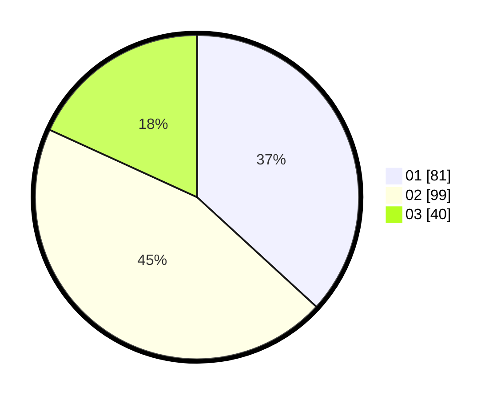

# Hasil

Hasil perolehan suara paslon dapat dilihat pada file paslon-01.txt, paslon-02.txt, dan paslon-03.txt.

Jika tidak ada, artinya data tersebut belum ada pada SIREKAP.

## Perolehan Suara

 * Paslon 01: **81**.
 * Paslon 02: **99**.
 * Paslon 03: **40**.

## Foto C Plano

https://sirekap-obj-formc.kpu.go.id/7efc/pemilu/ppwp/31/75/09/10/01/3175091001087-20240216-111641--ee5b3dba-7032-4363-892d-9abffe70abdd.jpg

https://sirekap-obj-formc.kpu.go.id/7efc/pemilu/ppwp/31/75/09/10/01/3175091001087-20240216-111840--e2428e2f-a513-4f60-91fc-d389259e1ed8.jpg

https://sirekap-obj-formc.kpu.go.id/7efc/pemilu/ppwp/31/75/09/10/01/3175091001087-20240216-112958--46c9f93f-59ff-47de-b091-2374df80c57c.jpg

## DATA PEMILIH TETAP

Jumlah pemilih dalam DPT: **273**.
 * L: **128**.
 * P: **145**.

## DATA PENGGUNA HAK PILIH

Jumlah pengguna hak pilih dalam DPT: **232**.
 * L: **107**.
 * P: **125**.

Jumlah pengguna hak pilih dalam DPTb: **0**.
 * L: **0**.
 * P: **0**.

Jumlah pengguna hak pilih dalam DPK: **3**.
 * L: **1**.
 * P: **2**.

Jumlah pengguna hak pilih: **235**.
 * L: **108**.
 * P: **127**.

## JUMLAH SUARA SAH DAN TIDAK SAH

JUMLAH SELURUH SUARA SAH: **230**.

JUMLAH SUARA TIDAK SAH: **5**.

JUMLAH SELURUH SUARA SAH DAN SUARA TIDAK SAH: **235**.
