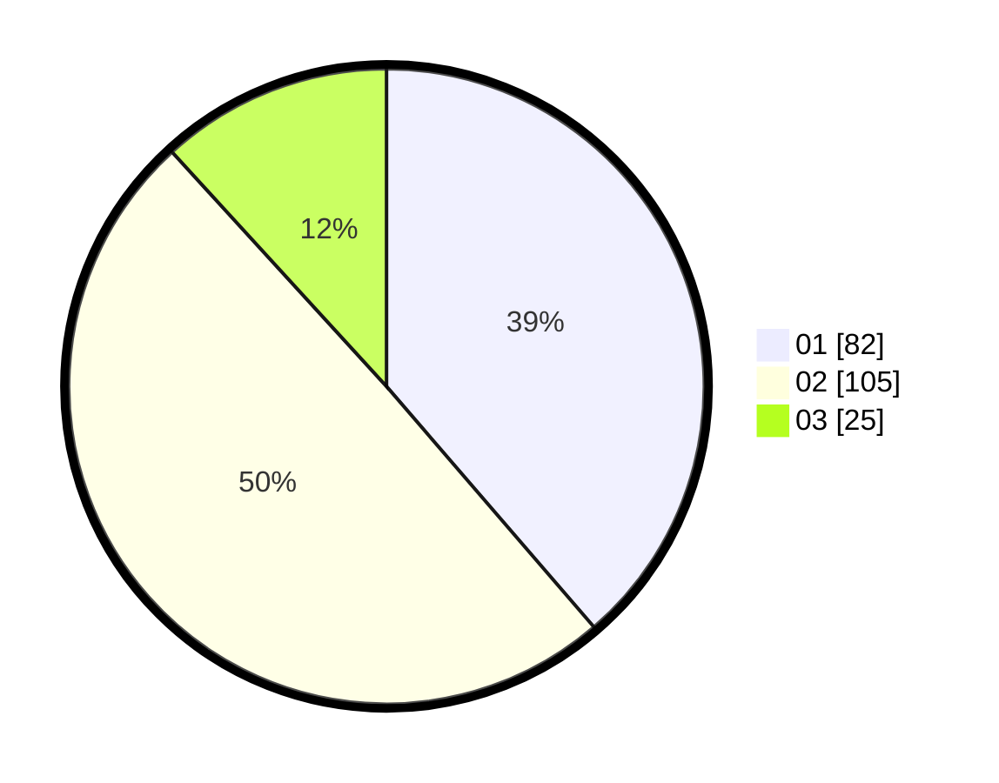

# Hasil

Hasil perolehan suara paslon dapat dilihat pada file paslon-01.txt, paslon-02.txt, dan paslon-03.txt.

Jika tidak ada, artinya data tersebut belum ada pada SIREKAP.

## Perolehan Suara

 * Paslon 01: **82**.
 * Paslon 02: **105**.
 * Paslon 03: **25**.

## Foto C Plano

https://sirekap-obj-formc.kpu.go.id/690f/pemilu/ppwp/31/75/09/10/01/3175091001093-20240214-155334--2dbd1f28-3975-4b12-abb3-1264ccb45500.jpg

https://sirekap-obj-formc.kpu.go.id/690f/pemilu/ppwp/31/75/09/10/01/3175091001093-20240214-155737--3b43b348-a185-4dc5-b3f2-c5b21de1c5d3.jpg

https://sirekap-obj-formc.kpu.go.id/690f/pemilu/ppwp/31/75/09/10/01/3175091001093-20240214-212121--0465d7db-38f3-41fe-9a93-aa4066ed7f53.jpg

## DATA PEMILIH TETAP

Jumlah pemilih dalam DPT: **279**.
 * L: **134**.
 * P: **145**.

## DATA PENGGUNA HAK PILIH

Jumlah pengguna hak pilih dalam DPT: **220**.
 * L: **102**.
 * P: **117**.

Jumlah pengguna hak pilih dalam DPTb: **0**.
 * L: **0**.
 * P: **0**.

Jumlah pengguna hak pilih dalam DPK: **1**.
 * L: **1**.
 * P: **0**.

Jumlah pengguna hak pilih: **220**.
 * L: **102**.
 * P: **117**.

## JUMLAH SUARA SAH DAN TIDAK SAH

JUMLAH SELURUH SUARA SAH: **212**.

JUMLAH SUARA TIDAK SAH: **8**.

JUMLAH SELURUH SUARA SAH DAN SUARA TIDAK SAH: **220**.
