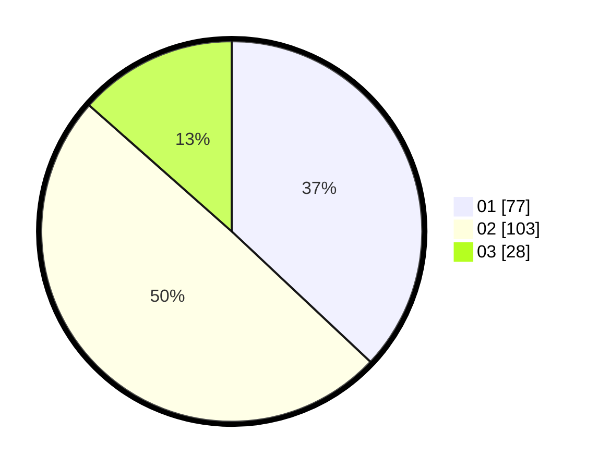

# Hasil

Hasil perolehan suara paslon dapat dilihat pada file paslon-01.txt, paslon-02.txt, dan paslon-03.txt.

Jika tidak ada, artinya data tersebut belum ada pada SIREKAP.

## Perolehan Suara

 * Paslon 01: **77**.
 * Paslon 02: **103**.
 * Paslon 03: **28**.

## Foto C Plano

https://sirekap-obj-formc.kpu.go.id/d599/pemilu/ppwp/31/75/09/10/01/3175091001094-20240217-154925--ec313de3-a9cf-4550-8d33-9493d2dbc932.jpg

https://sirekap-obj-formc.kpu.go.id/d599/pemilu/ppwp/31/75/09/10/01/3175091001094-20240217-155635--389c80b0-2dc3-413b-a67e-d4cb1263c12a.jpg

https://sirekap-obj-formc.kpu.go.id/d599/pemilu/ppwp/31/75/09/10/01/3175091001094-20240217-155737--1fa808ea-53aa-4660-a776-58ec18f02fbb.jpg

## DATA PEMILIH TETAP

Jumlah pemilih dalam DPT: **284**.
 * L: **138**.
 * P: **146**.

## DATA PENGGUNA HAK PILIH

Jumlah pengguna hak pilih dalam DPT: **213**.
 * L: **97**.
 * P: **116**.

Jumlah pengguna hak pilih dalam DPTb: **0**.
 * L: **0**.
 * P: **0**.

Jumlah pengguna hak pilih dalam DPK: **1**.
 * L: **0**.
 * P: **1**.

Jumlah pengguna hak pilih: **214**.
 * L: **97**.
 * P: **117**.

## JUMLAH SUARA SAH DAN TIDAK SAH

JUMLAH SELURUH SUARA SAH: **208**.

JUMLAH SUARA TIDAK SAH: **6**.

JUMLAH SELURUH SUARA SAH DAN SUARA TIDAK SAH: **214**.
