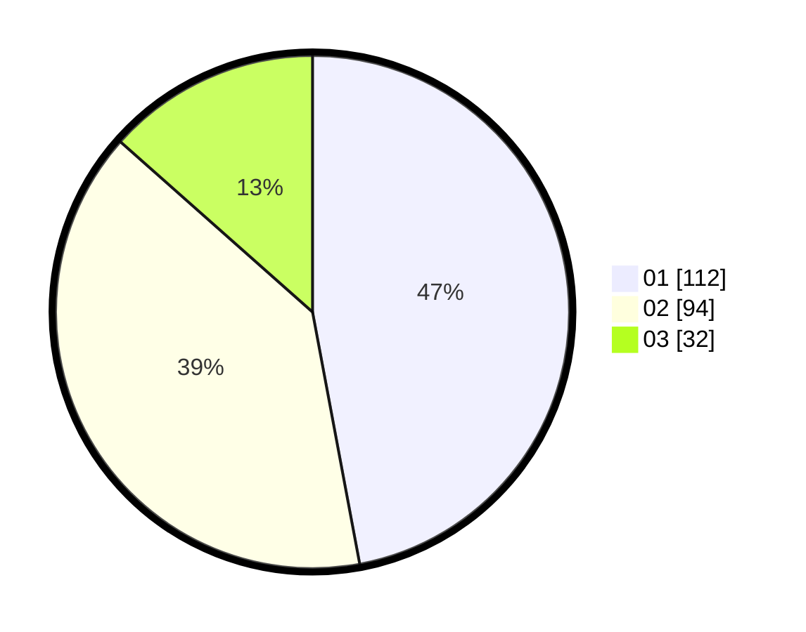

# Hasil

Hasil perolehan suara paslon dapat dilihat pada file paslon-01.txt, paslon-02.txt, dan paslon-03.txt.

Jika tidak ada, artinya data tersebut belum ada pada SIREKAP.

## Perolehan Suara

 * Paslon 01: **112**.
 * Paslon 02: **94**.
 * Paslon 03: **32**.

## Foto C Plano

https://sirekap-obj-formc.kpu.go.id/5c31/pemilu/ppwp/31/75/09/10/01/3175091001098-20240217-064417--9a150d5f-8900-4e97-bb3d-2fdb690d22f8.jpg

https://sirekap-obj-formc.kpu.go.id/5c31/pemilu/ppwp/31/75/09/10/01/3175091001098-20240217-064504--c9480d5d-5823-4453-84a4-7ebc460de15f.jpg

https://sirekap-obj-formc.kpu.go.id/5c31/pemilu/ppwp/31/75/09/10/01/3175091001098-20240217-065438--1fbc9bc2-ffe7-4727-9712-3b60d668e5d9.jpg

## DATA PEMILIH TETAP

Jumlah pemilih dalam DPT: **238**.
 * L: **115**.
 * P: **123**.

## DATA PENGGUNA HAK PILIH

Jumlah pengguna hak pilih dalam DPT: **275**.
 * L: **145**.
 * P: **130**.

Jumlah pengguna hak pilih dalam DPTb: **2**.
 * L: **2**.
 * P: **0**.

Jumlah pengguna hak pilih dalam DPK: **3**.
 * L: **0**.
 * P: **3**.

Jumlah pengguna hak pilih: **280**.
 * L: **147**.
 * P: **133**.

## JUMLAH SUARA SAH DAN TIDAK SAH

JUMLAH SELURUH SUARA SAH: **238**.

JUMLAH SUARA TIDAK SAH: **0**.

JUMLAH SELURUH SUARA SAH DAN SUARA TIDAK SAH: **238**.
