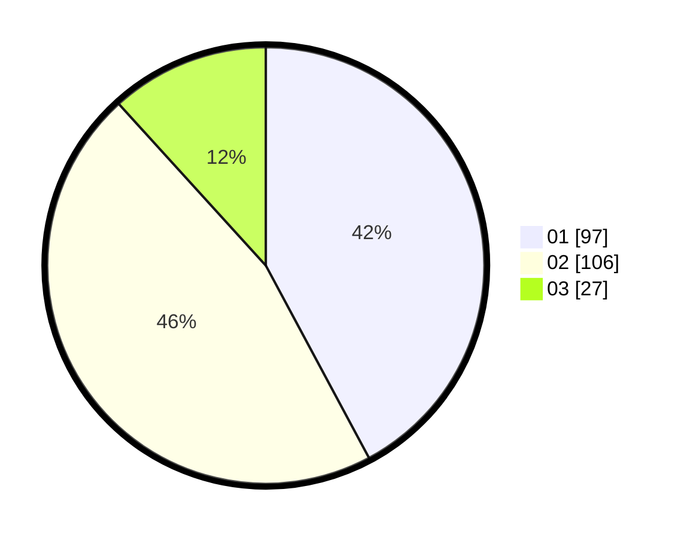

# Hasil

Hasil perolehan suara paslon dapat dilihat pada file paslon-01.txt, paslon-02.txt, dan paslon-03.txt.

Jika tidak ada, artinya data tersebut belum ada pada SIREKAP.

## Perolehan Suara

 * Paslon 01: **97**.
 * Paslon 02: **106**.
 * Paslon 03: **27**.

## Foto C Plano

https://sirekap-obj-formc.kpu.go.id/b003/pemilu/ppwp/31/75/09/10/01/3175091001100-20240216-212518--f6f0ea00-b839-49ac-8e16-8526ec16e408.jpg

https://sirekap-obj-formc.kpu.go.id/b003/pemilu/ppwp/31/75/09/10/01/3175091001100-20240214-213440--eb63123c-4836-4287-855f-f7abf563c404.jpg

https://sirekap-obj-formc.kpu.go.id/b003/pemilu/ppwp/31/75/09/10/01/3175091001100-20240214-213307--435f774e-c987-4632-997b-c84b1709f7ee.jpg
