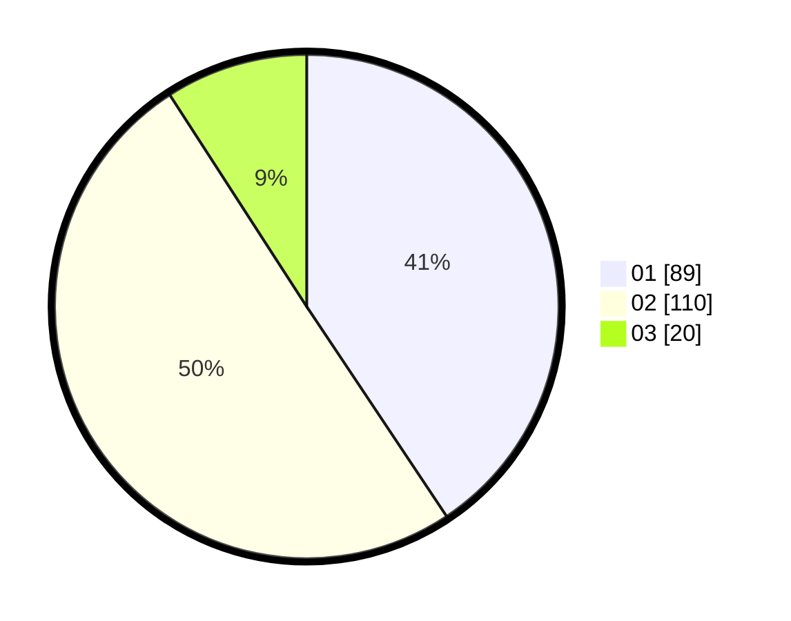

# Hasil

Hasil perolehan suara paslon dapat dilihat pada file paslon-01.txt, paslon-02.txt, dan paslon-03.txt.

Jika tidak ada, artinya data tersebut belum ada pada SIREKAP.

## Perolehan Suara

 * Paslon 01: **89**.
 * Paslon 02: **110**.
 * Paslon 03: **20**.

## Foto C Plano

https://sirekap-obj-formc.kpu.go.id/b127/pemilu/ppwp/31/75/09/10/01/3175091001103-20240215-002346--1af8dade-ed61-433b-b9a3-8a9c59361f08.jpg

https://sirekap-obj-formc.kpu.go.id/b127/pemilu/ppwp/31/75/09/10/01/3175091001103-20240214-191437--5b6758d5-ad6b-4810-afc3-b59ab7ec085b.jpg

https://sirekap-obj-formc.kpu.go.id/b127/pemilu/ppwp/31/75/09/10/01/3175091001103-20240214-191525--e424b183-0b98-48b3-b5cf-542ecb79ac21.jpg
