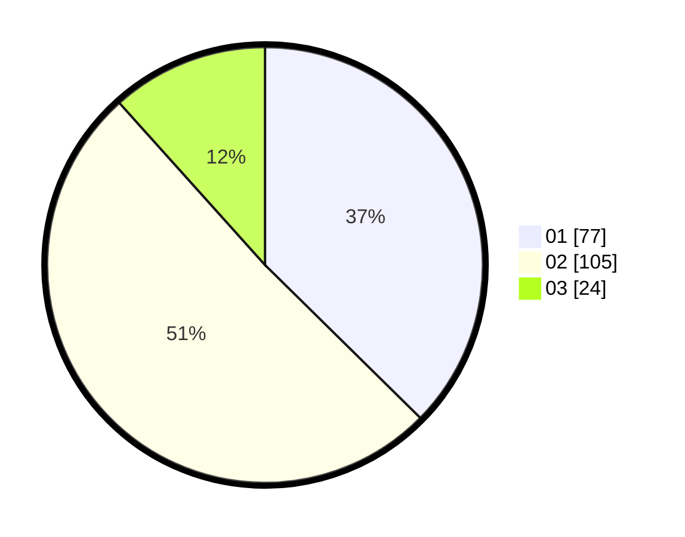

# Hasil

Hasil perolehan suara paslon dapat dilihat pada file paslon-01.txt, paslon-02.txt, dan paslon-03.txt.

Jika tidak ada, artinya data tersebut belum ada pada SIREKAP.

## Perolehan Suara

 * Paslon 01: **77**.
 * Paslon 02: **105**.
 * Paslon 03: **24**.

## Foto C Plano

https://sirekap-obj-formc.kpu.go.id/5bd2/pemilu/ppwp/31/75/09/10/01/3175091001111-20240214-221258--a2fafad5-93f7-4625-9a74-dca2a724d706.jpg

https://sirekap-obj-formc.kpu.go.id/5bd2/pemilu/ppwp/31/75/09/10/01/3175091001111-20240214-221745--b7a26c40-6d39-46ab-bee8-90e93758d6e2.jpg

https://sirekap-obj-formc.kpu.go.id/5bd2/pemilu/ppwp/31/75/09/10/01/3175091001111-20240214-222059--3cba8665-22cf-4fba-8182-23c0d8395b1b.jpg
