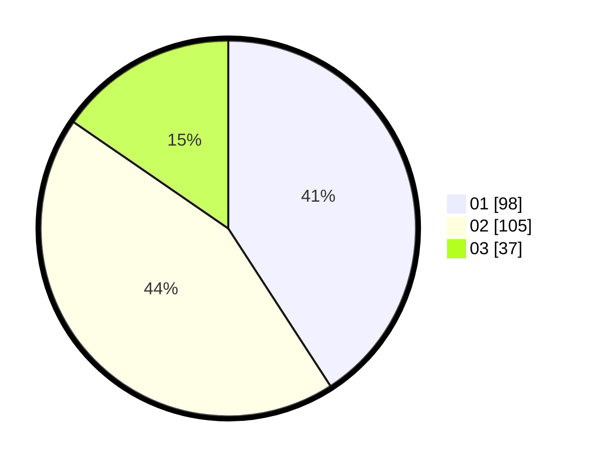

# Hasil

Hasil perolehan suara paslon dapat dilihat pada file paslon-01.txt, paslon-02.txt, dan paslon-03.txt.

Jika tidak ada, artinya data tersebut belum ada pada SIREKAP.

## Perolehan Suara

 * Paslon 01: **98**.
 * Paslon 02: **105**.
 * Paslon 03: **37**.

## Foto C Plano

https://sirekap-obj-formc.kpu.go.id/90e4/pemilu/ppwp/31/75/09/10/01/3175091001114-20240219-140303--54133924-c0c3-4aa7-9e8c-605e584b5e06.jpg

https://sirekap-obj-formc.kpu.go.id/90e4/pemilu/ppwp/31/75/09/10/01/3175091001114-20240219-141027--8ffbcfdb-2c4b-41cb-86e4-7c39c5ddb953.jpg

https://sirekap-obj-formc.kpu.go.id/90e4/pemilu/ppwp/31/75/09/10/01/3175091001114-20240219-141454--44d02814-5efa-49c7-9db4-ffb2ad9ef8e5.jpg

## DATA PEMILIH TETAP

Jumlah pemilih dalam DPT: **282**.
 * L: **143**.
 * P: **139**.

## DATA PENGGUNA HAK PILIH

Jumlah pengguna hak pilih dalam DPT: **242**.
 * L: **116**.
 * P: **126**.

Jumlah pengguna hak pilih dalam DPTb: **0**.
 * L: **0**.
 * P: **0**.

Jumlah pengguna hak pilih dalam DPK: **0**.
 * L: **0**.
 * P: **0**.

Jumlah pengguna hak pilih: **242**.
 * L: **116**.
 * P: **126**.

## JUMLAH SUARA SAH DAN TIDAK SAH

JUMLAH SELURUH SUARA SAH: **240**.

JUMLAH SUARA TIDAK SAH: **2**.

JUMLAH SELURUH SUARA SAH DAN SUARA TIDAK SAH: **242**.
