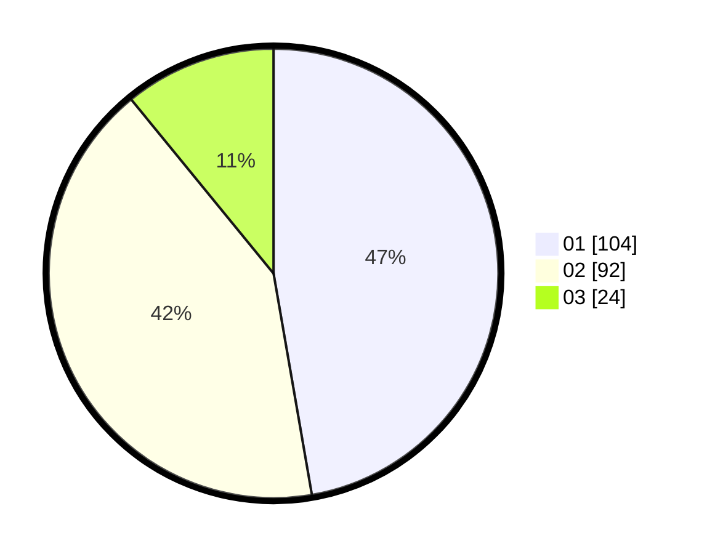

# Hasil

Hasil perolehan suara paslon dapat dilihat pada file paslon-01.txt, paslon-02.txt, dan paslon-03.txt.

Jika tidak ada, artinya data tersebut belum ada pada SIREKAP.

## Perolehan Suara

 * Paslon 01: **104**.
 * Paslon 02: **92**.
 * Paslon 03: **24**.

## Foto C Plano

https://sirekap-obj-formc.kpu.go.id/95b0/pemilu/ppwp/31/75/09/10/01/3175091001116-20240217-212537--edef8c71-f97e-42dc-8ef3-816717facc82.jpg

https://sirekap-obj-formc.kpu.go.id/95b0/pemilu/ppwp/31/75/09/10/01/3175091001116-20240217-212537--3309c70f-63a6-49de-9d8a-d6e25ec222c5.jpg

https://sirekap-obj-formc.kpu.go.id/95b0/pemilu/ppwp/31/75/09/10/01/3175091001116-20240217-212102--300dfc84-fabb-41be-95c0-627a80c43f62.jpg

## DATA PEMILIH TETAP

Jumlah pemilih dalam DPT: **288**.
 * L: **141**.
 * P: **147**.

## DATA PENGGUNA HAK PILIH

Jumlah pengguna hak pilih dalam DPT: **220**.
 * L: **110**.
 * P: **110**.

Jumlah pengguna hak pilih dalam DPTb: **0**.
 * L: **0**.
 * P: **0**.

Jumlah pengguna hak pilih dalam DPK: **1**.
 * L: **1**.
 * P: **0**.

Jumlah pengguna hak pilih: **221**.
 * L: **111**.
 * P: **110**.

## JUMLAH SUARA SAH DAN TIDAK SAH

JUMLAH SELURUH SUARA SAH: **220**.

JUMLAH SUARA TIDAK SAH: **1**.

JUMLAH SELURUH SUARA SAH DAN SUARA TIDAK SAH: **221**.
