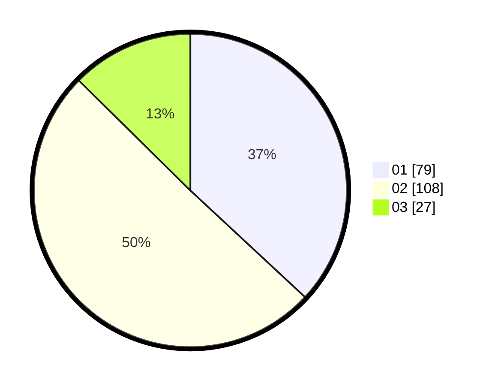

# Hasil

Hasil perolehan suara paslon dapat dilihat pada file paslon-01.txt, paslon-02.txt, dan paslon-03.txt.

Jika tidak ada, artinya data tersebut belum ada pada SIREKAP.

## Perolehan Suara

 * Paslon 01: **79**.
 * Paslon 02: **108**.
 * Paslon 03: **27**.

## Foto C Plano

https://sirekap-obj-formc.kpu.go.id/660d/pemilu/ppwp/31/75/09/10/01/3175091001119-20240214-155335--0cf98471-cbc6-48a3-b145-07fa755b285c.jpg

https://sirekap-obj-formc.kpu.go.id/660d/pemilu/ppwp/31/75/09/10/01/3175091001119-20240215-005109--c5d1924f-64ae-4636-93c3-a3c4c8db0d64.jpg

https://sirekap-obj-formc.kpu.go.id/660d/pemilu/ppwp/31/75/09/10/01/3175091001119-20240214-155349--bfc491a9-ebf9-4b82-b741-2571d0f307d5.jpg

## DATA PEMILIH TETAP

Jumlah pemilih dalam DPT: **272**.
 * L: **142**.
 * P: **130**.

## DATA PENGGUNA HAK PILIH

Jumlah pengguna hak pilih dalam DPT: **216**.
 * L: **112**.
 * P: **104**.

Jumlah pengguna hak pilih dalam DPTb: **0**.
 * L: **0**.
 * P: **0**.

Jumlah pengguna hak pilih dalam DPK: **0**.
 * L: **0**.
 * P: **0**.

Jumlah pengguna hak pilih: **216**.
 * L: **112**.
 * P: **104**.

## JUMLAH SUARA SAH DAN TIDAK SAH

JUMLAH SELURUH SUARA SAH: **214**.

JUMLAH SUARA TIDAK SAH: **2**.

JUMLAH SELURUH SUARA SAH DAN SUARA TIDAK SAH: **216**.
