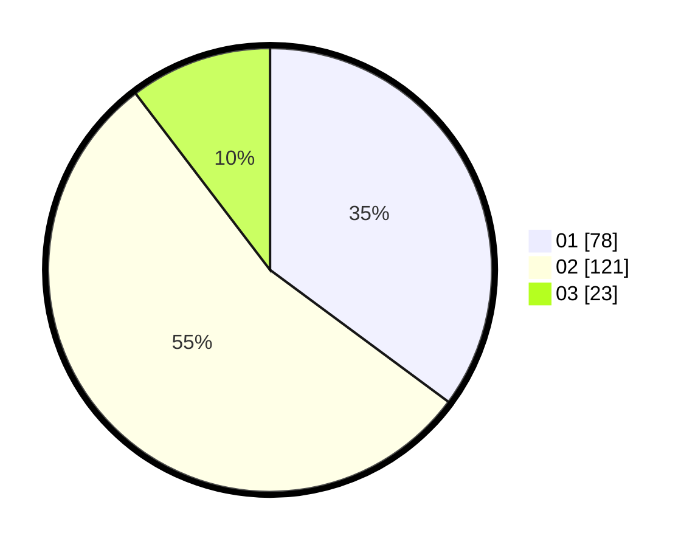

# Hasil

Hasil perolehan suara paslon dapat dilihat pada file paslon-01.txt, paslon-02.txt, dan paslon-03.txt.

Jika tidak ada, artinya data tersebut belum ada pada SIREKAP.

## Perolehan Suara

 * Paslon 01: **78**.
 * Paslon 02: **121**.
 * Paslon 03: **23**.

## Foto C Plano

https://sirekap-obj-formc.kpu.go.id/40c8/pemilu/ppwp/31/75/09/10/01/3175091001122-20240216-210341--788ea8c6-37c7-43f7-ab9f-2f946d8221a2.jpg

https://sirekap-obj-formc.kpu.go.id/40c8/pemilu/ppwp/31/75/09/10/01/3175091001122-20240216-210343--1c63d7ac-f46e-414b-b6de-6517bf843a29.jpg

https://sirekap-obj-formc.kpu.go.id/40c8/pemilu/ppwp/31/75/09/10/01/3175091001122-20240216-210342--96c61c4c-f2bc-4dff-b482-a09e0791af5d.jpg

## DATA PEMILIH TETAP

Jumlah pemilih dalam DPT: **267**.
 * L: **137**.
 * P: **130**.

## DATA PENGGUNA HAK PILIH

Jumlah pengguna hak pilih dalam DPT: **223**.
 * L: **109**.
 * P: **114**.

Jumlah pengguna hak pilih dalam DPTb: **0**.
 * L: **0**.
 * P: **0**.

Jumlah pengguna hak pilih dalam DPK: **1**.
 * L: **1**.
 * P: **0**.

Jumlah pengguna hak pilih: **224**.
 * L: **110**.
 * P: **114**.

## JUMLAH SUARA SAH DAN TIDAK SAH

JUMLAH SELURUH SUARA SAH: **222**.

JUMLAH SUARA TIDAK SAH: **2**.

JUMLAH SELURUH SUARA SAH DAN SUARA TIDAK SAH: **224**.
