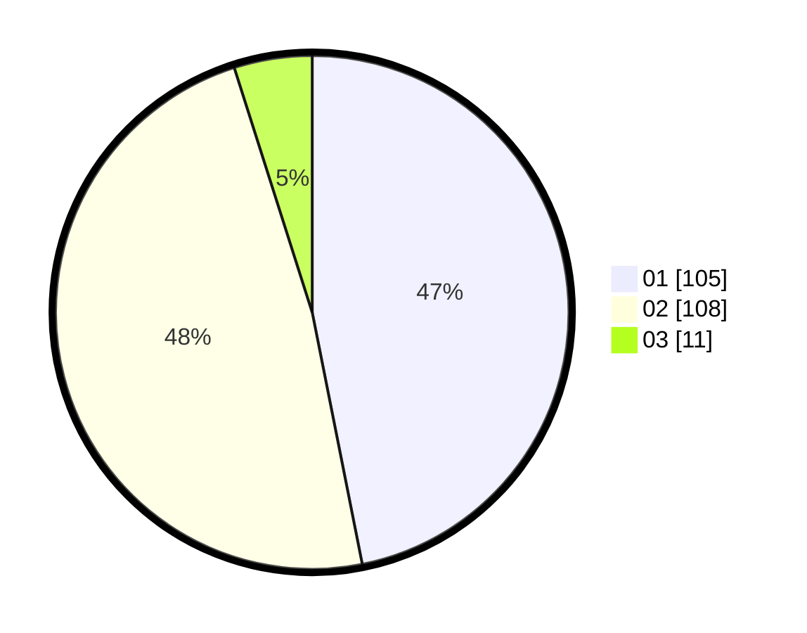

# Hasil

Hasil perolehan suara paslon dapat dilihat pada file paslon-01.txt, paslon-02.txt, dan paslon-03.txt.

Jika tidak ada, artinya data tersebut belum ada pada SIREKAP.

## Perolehan Suara

 * Paslon 01: **105**.
 * Paslon 02: **108**.
 * Paslon 03: **11**.

## Foto C Plano

https://sirekap-obj-formc.kpu.go.id/1526/pemilu/ppwp/31/75/09/10/01/3175091001129-20240214-155328--11a45443-b58f-464b-a492-fbc17a25cb64.jpg

https://sirekap-obj-formc.kpu.go.id/1526/pemilu/ppwp/31/75/09/10/01/3175091001129-20240214-212119--e7f4381a-b67f-4889-b9f9-7bef411daf79.jpg

https://sirekap-obj-formc.kpu.go.id/1526/pemilu/ppwp/31/75/09/10/01/3175091001129-20240214-233219--28d2d1d9-25b0-43a2-a88e-b1bac4df077f.jpg

## DATA PEMILIH TETAP

Jumlah pemilih dalam DPT: **283**.
 * L: **143**.
 * P: **140**.

## DATA PENGGUNA HAK PILIH

Jumlah pengguna hak pilih dalam DPT: **229**.
 * L: **116**.
 * P: **113**.

Jumlah pengguna hak pilih dalam DPTb: **0**.
 * L: **0**.
 * P: **0**.

Jumlah pengguna hak pilih dalam DPK: **0**.
 * L: **0**.
 * P: **0**.

Jumlah pengguna hak pilih: **229**.
 * L: **116**.
 * P: **113**.

## JUMLAH SUARA SAH DAN TIDAK SAH

JUMLAH SELURUH SUARA SAH: **224**.

JUMLAH SUARA TIDAK SAH: **5**.

JUMLAH SELURUH SUARA SAH DAN SUARA TIDAK SAH: **229**.
