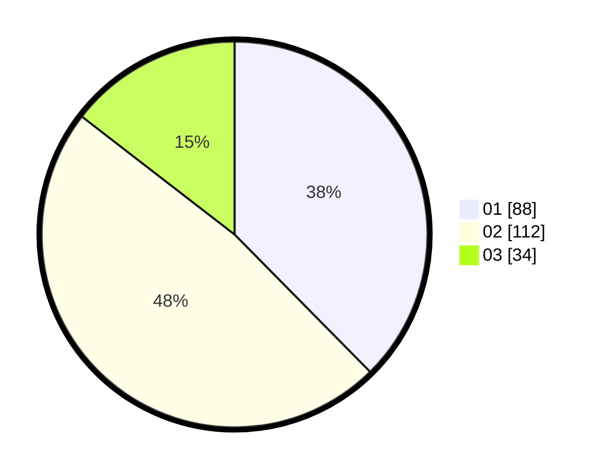

# Hasil

Hasil perolehan suara paslon dapat dilihat pada file paslon-01.txt, paslon-02.txt, dan paslon-03.txt.

Jika tidak ada, artinya data tersebut belum ada pada SIREKAP.

## Perolehan Suara

 * Paslon 01: **88**.
 * Paslon 02: **112**.
 * Paslon 03: **34**.

## Foto C Plano

https://sirekap-obj-formc.kpu.go.id/80a2/pemilu/ppwp/31/75/09/10/01/3175091001131-20240216-144119--3d66ff27-f047-4bc5-b00d-d495a12d99ba.jpg

https://sirekap-obj-formc.kpu.go.id/80a2/pemilu/ppwp/31/75/09/10/01/3175091001131-20240216-144120--19fe8801-dd73-4937-a672-9938e60a78e2.jpg

https://sirekap-obj-formc.kpu.go.id/80a2/pemilu/ppwp/31/75/09/10/01/3175091001131-20240216-144119--df67e423-4806-40f3-9549-4061feecf83d.jpg

## DATA PEMILIH TETAP

Jumlah pemilih dalam DPT: **285**.
 * L: **153**.
 * P: **132**.

## DATA PENGGUNA HAK PILIH

Jumlah pengguna hak pilih dalam DPT: **240**.
 * L: **126**.
 * P: **114**.

Jumlah pengguna hak pilih dalam DPTb: **0**.
 * L: **0**.
 * P: **0**.

Jumlah pengguna hak pilih dalam DPK: **0**.
 * L: **0**.
 * P: **0**.

Jumlah pengguna hak pilih: **240**.
 * L: **126**.
 * P: **114**.

## JUMLAH SUARA SAH DAN TIDAK SAH

JUMLAH SELURUH SUARA SAH: **234**.

JUMLAH SUARA TIDAK SAH: **6**.

JUMLAH SELURUH SUARA SAH DAN SUARA TIDAK SAH: **240**.
