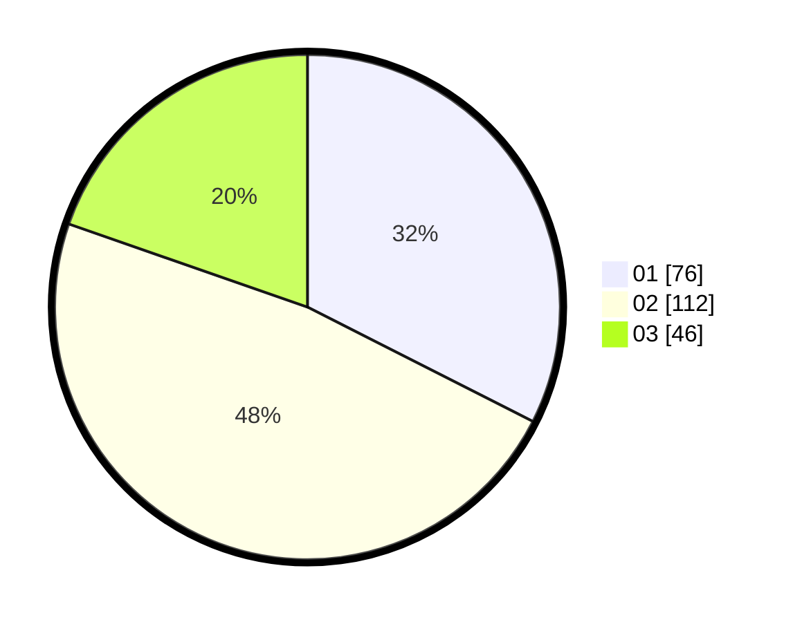

# Hasil

Hasil perolehan suara paslon dapat dilihat pada file paslon-01.txt, paslon-02.txt, dan paslon-03.txt.

Jika tidak ada, artinya data tersebut belum ada pada SIREKAP.

## Perolehan Suara

 * Paslon 01: **76**.
 * Paslon 02: **112**.
 * Paslon 03: **46**.

## Foto C Plano

https://sirekap-obj-formc.kpu.go.id/0c46/pemilu/ppwp/31/75/09/10/01/3175091001134-20240215-131023--cf55cb60-8253-4101-82d6-5ed0db73c23a.jpg

https://sirekap-obj-formc.kpu.go.id/0c46/pemilu/ppwp/31/75/09/10/01/3175091001134-20240216-143906--8beb0788-786e-48e1-b66f-e04e2a95269f.jpg

https://sirekap-obj-formc.kpu.go.id/0c46/pemilu/ppwp/31/75/09/10/01/3175091001134-20240216-155541--651e9745-72dc-4f43-b204-588df6edee37.jpg

## DATA PEMILIH TETAP

Jumlah pemilih dalam DPT: **286**.
 * L: **144**.
 * P: **142**.

## DATA PENGGUNA HAK PILIH

Jumlah pengguna hak pilih dalam DPT: **237**.
 * L: **116**.
 * P: **121**.

Jumlah pengguna hak pilih dalam DPTb: **1**.
 * L: **1**.
 * P: **0**.

Jumlah pengguna hak pilih dalam DPK: **0**.
 * L: **0**.
 * P: **0**.

Jumlah pengguna hak pilih: **238**.
 * L: **117**.
 * P: **121**.

## JUMLAH SUARA SAH DAN TIDAK SAH

JUMLAH SELURUH SUARA SAH: **234**.

JUMLAH SUARA TIDAK SAH: **4**.

JUMLAH SELURUH SUARA SAH DAN SUARA TIDAK SAH: **238**.
