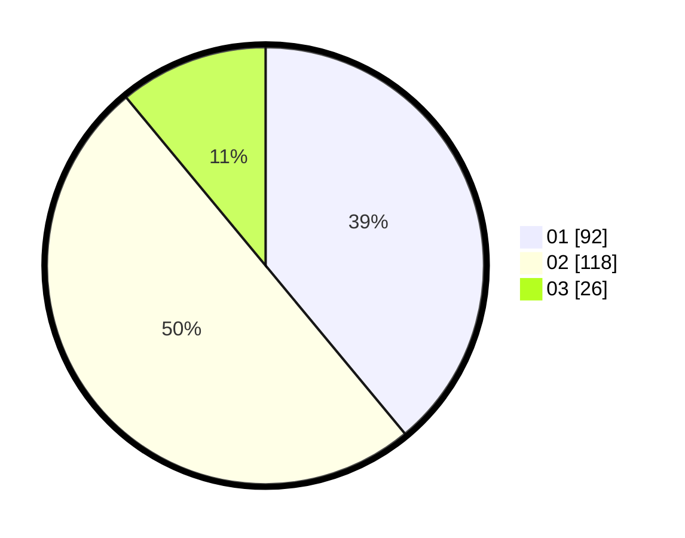

# Hasil

Hasil perolehan suara paslon dapat dilihat pada file paslon-01.txt, paslon-02.txt, dan paslon-03.txt.

Jika tidak ada, artinya data tersebut belum ada pada SIREKAP.

## Perolehan Suara

 * Paslon 01: **92**.
 * Paslon 02: **118**.
 * Paslon 03: **26**.

## Foto C Plano

https://sirekap-obj-formc.kpu.go.id/3861/pemilu/ppwp/31/75/09/10/01/3175091001135-20240214-215847--5391c974-158f-41f8-b06a-9371ed302381.jpg

https://sirekap-obj-formc.kpu.go.id/3861/pemilu/ppwp/31/75/09/10/01/3175091001135-20240214-200311--65903628-3f58-4735-95fe-6300c6364327.jpg

https://sirekap-obj-formc.kpu.go.id/3861/pemilu/ppwp/31/75/09/10/01/3175091001135-20240214-200445--1ead0325-fa5f-4c3e-93c1-a2b3e00af206.jpg

## DATA PEMILIH TETAP

Jumlah pemilih dalam DPT: **286**.
 * L: **141**.
 * P: **145**.

## DATA PENGGUNA HAK PILIH

Jumlah pengguna hak pilih dalam DPT: **286**.
 * L: **141**.
 * P: **145**.

Jumlah pengguna hak pilih dalam DPTb: **0**.
 * L: **0**.
 * P: **0**.

Jumlah pengguna hak pilih dalam DPK: **1**.
 * L: **0**.
 * P: **1**.

Jumlah pengguna hak pilih: **287**.
 * L: **141**.
 * P: **146**.

## JUMLAH SUARA SAH DAN TIDAK SAH

JUMLAH SELURUH SUARA SAH: **236**.

JUMLAH SUARA TIDAK SAH: **4**.

JUMLAH SELURUH SUARA SAH DAN SUARA TIDAK SAH: **240**.
