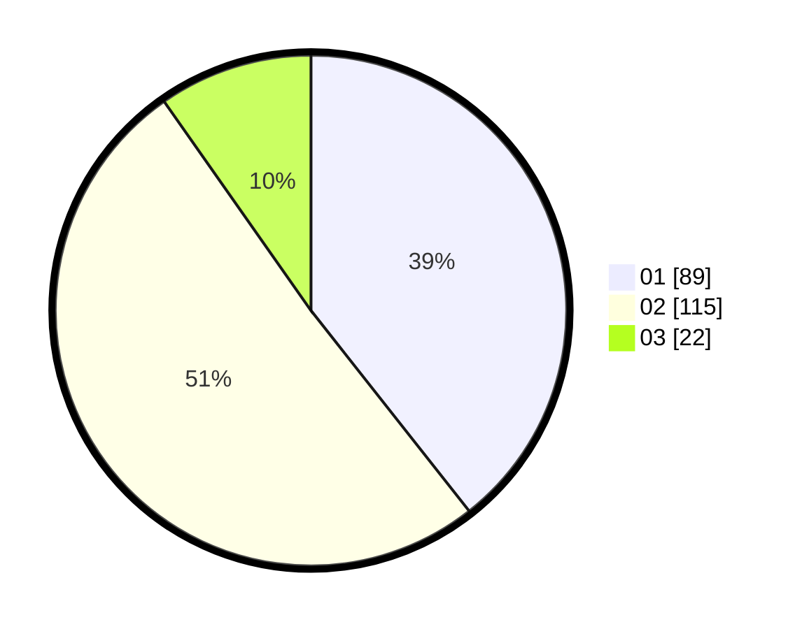

# Hasil

Hasil perolehan suara paslon dapat dilihat pada file paslon-01.txt, paslon-02.txt, dan paslon-03.txt.

Jika tidak ada, artinya data tersebut belum ada pada SIREKAP.

## Perolehan Suara

 * Paslon 01: **89**.
 * Paslon 02: **115**.
 * Paslon 03: **22**.

## Foto C Plano

https://sirekap-obj-formc.kpu.go.id/8d40/pemilu/ppwp/31/75/09/10/01/3175091001136-20240215-005103--ca3cfbcd-cadc-4042-af2f-8f99c25acce6.jpg

https://sirekap-obj-formc.kpu.go.id/8d40/pemilu/ppwp/31/75/09/10/01/3175091001136-20240216-150958--56424f97-3f40-478c-9fc5-89adec9714fb.jpg

https://sirekap-obj-formc.kpu.go.id/8d40/pemilu/ppwp/31/75/09/10/01/3175091001136-20240216-150957--9c050f60-73a8-4d5f-8ece-a690d0dd13b6.jpg

## DATA PEMILIH TETAP

Jumlah pemilih dalam DPT: **287**.
 * L: **136**.
 * P: **151**.

## DATA PENGGUNA HAK PILIH

Jumlah pengguna hak pilih dalam DPT: **228**.
 * L: **100**.
 * P: **128**.

Jumlah pengguna hak pilih dalam DPTb: **0**.
 * L: **0**.
 * P: **0**.

Jumlah pengguna hak pilih dalam DPK: **2**.
 * L: **1**.
 * P: **1**.

Jumlah pengguna hak pilih: **230**.
 * L: **101**.
 * P: **129**.

## JUMLAH SUARA SAH DAN TIDAK SAH

JUMLAH SELURUH SUARA SAH: **226**.

JUMLAH SUARA TIDAK SAH: **4**.

JUMLAH SELURUH SUARA SAH DAN SUARA TIDAK SAH: **230**.
