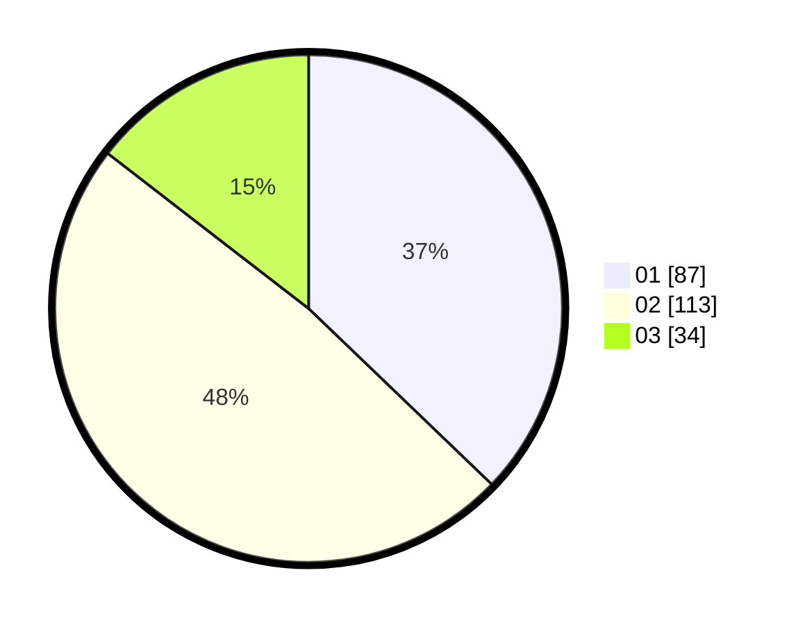

# Hasil

Hasil perolehan suara paslon dapat dilihat pada file paslon-01.txt, paslon-02.txt, dan paslon-03.txt.

Jika tidak ada, artinya data tersebut belum ada pada SIREKAP.

## Perolehan Suara

 * Paslon 01: **87**.
 * Paslon 02: **113**.
 * Paslon 03: **34**.

## Foto C Plano

https://sirekap-obj-formc.kpu.go.id/9ac0/pemilu/ppwp/31/75/09/10/01/3175091001138-20240214-234417--dd554f69-b819-4513-a0f9-7b72e75995c6.jpg

https://sirekap-obj-formc.kpu.go.id/9ac0/pemilu/ppwp/31/75/09/10/01/3175091001138-20240214-234925--c8e909c2-ef4a-40fd-b4ac-7289a967f40b.jpg

https://sirekap-obj-formc.kpu.go.id/9ac0/pemilu/ppwp/31/75/09/10/01/3175091001138-20240215-045953--adf41678-e8d7-4de6-afb5-51a52276c203.jpg
