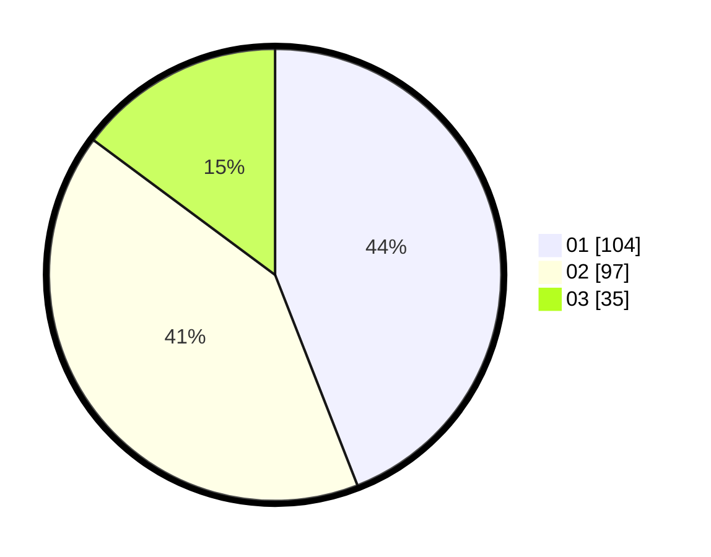

# Hasil

Hasil perolehan suara paslon dapat dilihat pada file paslon-01.txt, paslon-02.txt, dan paslon-03.txt.

Jika tidak ada, artinya data tersebut belum ada pada SIREKAP.

## Perolehan Suara

 * Paslon 01: **104**.
 * Paslon 02: **97**.
 * Paslon 03: **35**.

## Foto C Plano

https://sirekap-obj-formc.kpu.go.id/1a2e/pemilu/ppwp/31/75/09/10/01/3175091001144-20240216-042406--7c876d49-a829-4edf-93bd-e43bf320f3e3.jpg

https://sirekap-obj-formc.kpu.go.id/1a2e/pemilu/ppwp/31/75/09/10/01/3175091001144-20240216-042407--de6f4b3a-1f67-4478-a502-7eb8b9a81e84.jpg

https://sirekap-obj-formc.kpu.go.id/1a2e/pemilu/ppwp/31/75/09/10/01/3175091001144-20240216-042407--c04e136f-271c-47bf-b712-f420e6ff40a1.jpg

## DATA PEMILIH TETAP

Jumlah pemilih dalam DPT: **285**.
 * L: **151**.
 * P: **134**.

## DATA PENGGUNA HAK PILIH

Jumlah pengguna hak pilih dalam DPT: **240**.
 * L: **122**.
 * P: **118**.

Jumlah pengguna hak pilih dalam DPTb: **0**.
 * L: **0**.
 * P: **0**.

Jumlah pengguna hak pilih dalam DPK: **1**.
 * L: **0**.
 * P: **1**.

Jumlah pengguna hak pilih: **241**.
 * L: **122**.
 * P: **119**.

## JUMLAH SUARA SAH DAN TIDAK SAH

JUMLAH SELURUH SUARA SAH: **236**.

JUMLAH SUARA TIDAK SAH: **5**.

JUMLAH SELURUH SUARA SAH DAN SUARA TIDAK SAH: **241**.
