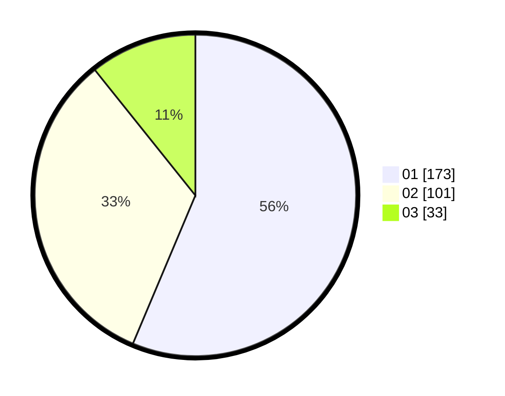

# Hasil

Hasil perolehan suara paslon dapat dilihat pada file paslon-01.txt, paslon-02.txt, dan paslon-03.txt.

Jika tidak ada, artinya data tersebut belum ada pada SIREKAP.

## Perolehan Suara

 * Paslon 01: **173**.
 * Paslon 02: **101**.
 * Paslon 03: **33**.

## Foto C Plano

https://sirekap-obj-formc.kpu.go.id/e369/pemilu/ppwp/31/75/09/10/01/3175091001151-20240214-195038--70eef91e-5207-40a5-89a2-29f0439e1bdd.jpg

https://sirekap-obj-formc.kpu.go.id/e369/pemilu/ppwp/31/75/09/10/01/3175091001151-20240214-195425--d876e4a6-1be1-4d0c-88a7-27746a570438.jpg

https://sirekap-obj-formc.kpu.go.id/e369/pemilu/ppwp/31/75/09/10/01/3175091001151-20240216-142612--2c4494d0-a528-4b5b-8504-85a3f767d1af.jpg

## DATA PEMILIH TETAP

Jumlah pemilih dalam DPT: **242**.
 * L: **123**.
 * P: **119**.

## DATA PENGGUNA HAK PILIH

Jumlah pengguna hak pilih dalam DPT: **242**.
 * L: **123**.
 * P: **119**.

Jumlah pengguna hak pilih dalam DPTb: **0**.
 * L: **0**.
 * P: **0**.

Jumlah pengguna hak pilih dalam DPK: **1**.
 * L: **0**.
 * P: **1**.

Jumlah pengguna hak pilih: **243**.
 * L: **123**.
 * P: **120**.

## JUMLAH SUARA SAH DAN TIDAK SAH

JUMLAH SELURUH SUARA SAH: **242**.

JUMLAH SUARA TIDAK SAH: **1**.

JUMLAH SELURUH SUARA SAH DAN SUARA TIDAK SAH: **243**.
