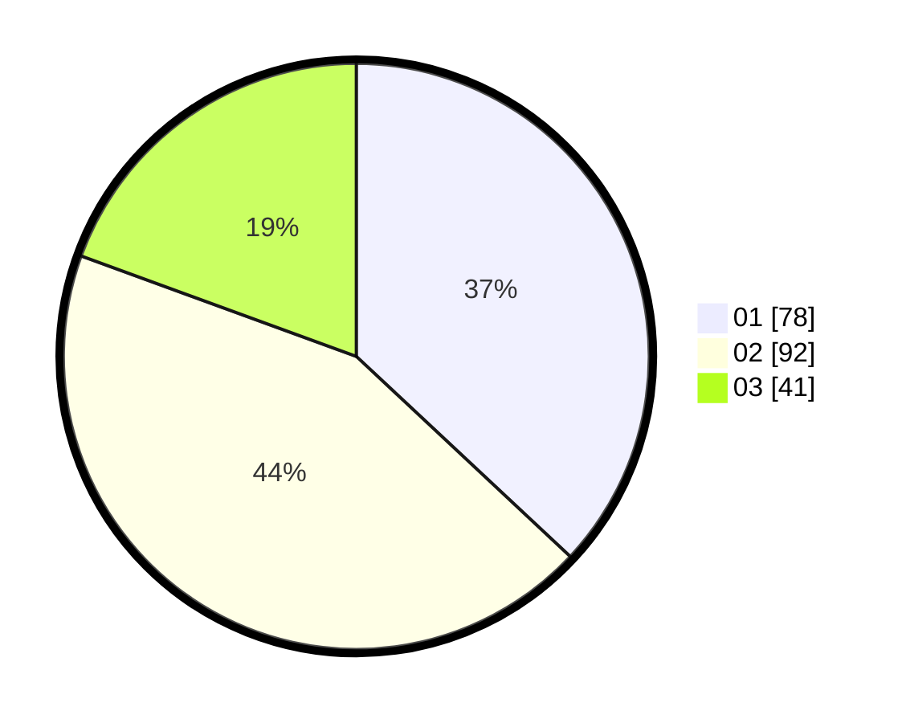

# Hasil

Hasil perolehan suara paslon dapat dilihat pada file paslon-01.txt, paslon-02.txt, dan paslon-03.txt.

Jika tidak ada, artinya data tersebut belum ada pada SIREKAP.

## Perolehan Suara

 * Paslon 01: **78**.
 * Paslon 02: **92**.
 * Paslon 03: **41**.

## Foto C Plano

https://sirekap-obj-formc.kpu.go.id/a764/pemilu/ppwp/31/75/09/10/01/3175091001155-20240215-065817--0f733184-2d73-4287-9995-fe2a9f6f3f17.jpg

https://sirekap-obj-formc.kpu.go.id/a764/pemilu/ppwp/31/75/09/10/01/3175091001155-20240215-065928--101ad76f-8234-48b3-93d8-063dc7b6a2f2.jpg

https://sirekap-obj-formc.kpu.go.id/a764/pemilu/ppwp/31/75/09/10/01/3175091001155-20240215-070100--74c2c261-6897-4f6f-83c0-fc14f98d939b.jpg

## DATA PEMILIH TETAP

Jumlah pemilih dalam DPT: **271**.
 * L: **144**.
 * P: **127**.

## DATA PENGGUNA HAK PILIH

Jumlah pengguna hak pilih dalam DPT: **214**.
 * L: **107**.
 * P: **107**.

Jumlah pengguna hak pilih dalam DPTb: **0**.
 * L: **0**.
 * P: **0**.

Jumlah pengguna hak pilih dalam DPK: **0**.
 * L: **0**.
 * P: **0**.

Jumlah pengguna hak pilih: **214**.
 * L: **107**.
 * P: **107**.

## JUMLAH SUARA SAH DAN TIDAK SAH

JUMLAH SELURUH SUARA SAH: **211**.

JUMLAH SUARA TIDAK SAH: **3**.

JUMLAH SELURUH SUARA SAH DAN SUARA TIDAK SAH: **214**.
