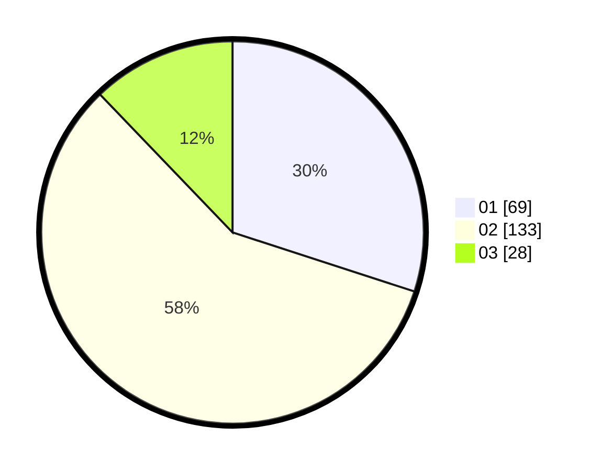

# Hasil

Hasil perolehan suara paslon dapat dilihat pada file paslon-01.txt, paslon-02.txt, dan paslon-03.txt.

Jika tidak ada, artinya data tersebut belum ada pada SIREKAP.

## Perolehan Suara

 * Paslon 01: **69**.
 * Paslon 02: **133**.
 * Paslon 03: **28**.

## Foto C Plano

https://sirekap-obj-formc.kpu.go.id/bfe5/pemilu/ppwp/31/75/09/10/01/3175091001156-20240215-024136--6cf1fe50-61a0-46b1-9a8f-bb6a77e344fe.jpg

https://sirekap-obj-formc.kpu.go.id/bfe5/pemilu/ppwp/31/75/09/10/01/3175091001156-20240214-220603--28af361c-3980-4cb0-88bf-ed341406dd06.jpg

https://sirekap-obj-formc.kpu.go.id/bfe5/pemilu/ppwp/31/75/09/10/01/3175091001156-20240214-220611--853d624f-0cdf-46e7-93ac-98bdbba3c529.jpg
