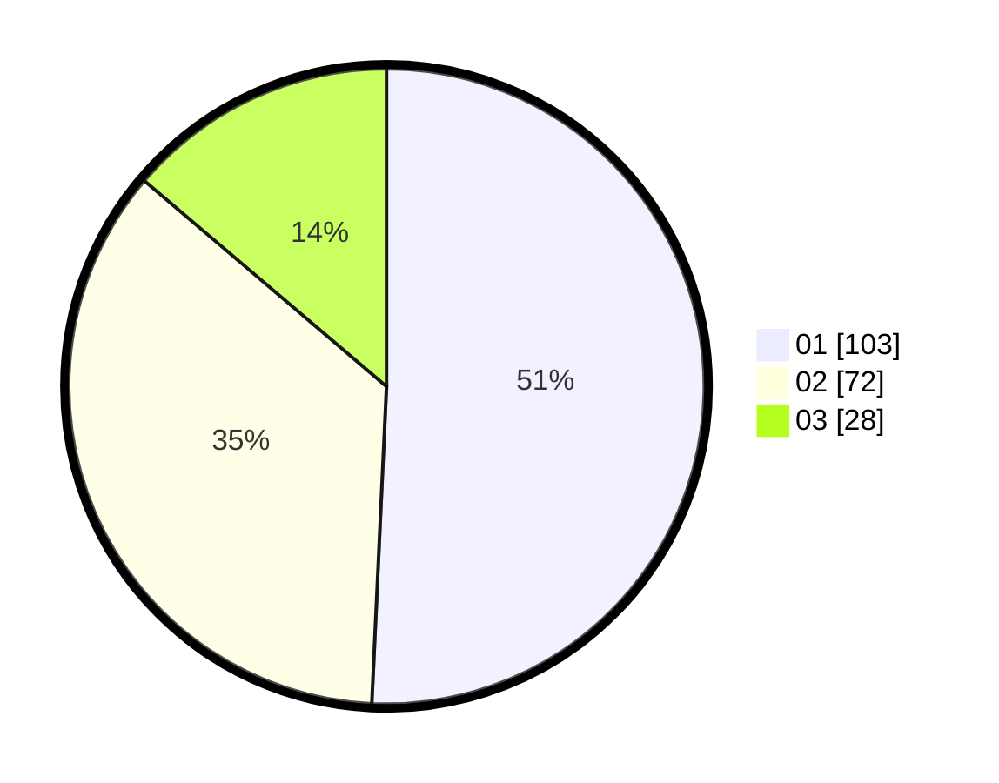

# Hasil

Hasil perolehan suara paslon dapat dilihat pada file paslon-01.txt, paslon-02.txt, dan paslon-03.txt.

Jika tidak ada, artinya data tersebut belum ada pada SIREKAP.

## Perolehan Suara

 * Paslon 01: **103**.
 * Paslon 02: **72**.
 * Paslon 03: **28**.

## Foto C Plano

https://sirekap-obj-formc.kpu.go.id/2e2e/pemilu/ppwp/31/75/09/10/01/3175091001158-20240214-185113--7e643bc5-e826-462c-b6e2-35ec71d57770.jpg

https://sirekap-obj-formc.kpu.go.id/2e2e/pemilu/ppwp/31/75/09/10/01/3175091001158-20240214-184510--95921298-76f2-4714-970c-29fa6b2566e4.jpg

https://sirekap-obj-formc.kpu.go.id/2e2e/pemilu/ppwp/31/75/09/10/01/3175091001158-20240214-184518--312f5af0-26df-46b1-8cd6-7768f2f16f7f.jpg

## DATA PEMILIH TETAP

Jumlah pemilih dalam DPT: **248**.
 * L: **126**.
 * P: **122**.

## DATA PENGGUNA HAK PILIH

Jumlah pengguna hak pilih dalam DPT: **204**.
 * L: **97**.
 * P: **107**.

Jumlah pengguna hak pilih dalam DPTb: **1**.
 * L: **0**.
 * P: **1**.

Jumlah pengguna hak pilih dalam DPK: **0**.
 * L: **0**.
 * P: **0**.

Jumlah pengguna hak pilih: **205**.
 * L: **97**.
 * P: **108**.

## JUMLAH SUARA SAH DAN TIDAK SAH

JUMLAH SELURUH SUARA SAH: **203**.

JUMLAH SUARA TIDAK SAH: **2**.

JUMLAH SELURUH SUARA SAH DAN SUARA TIDAK SAH: **205**.
