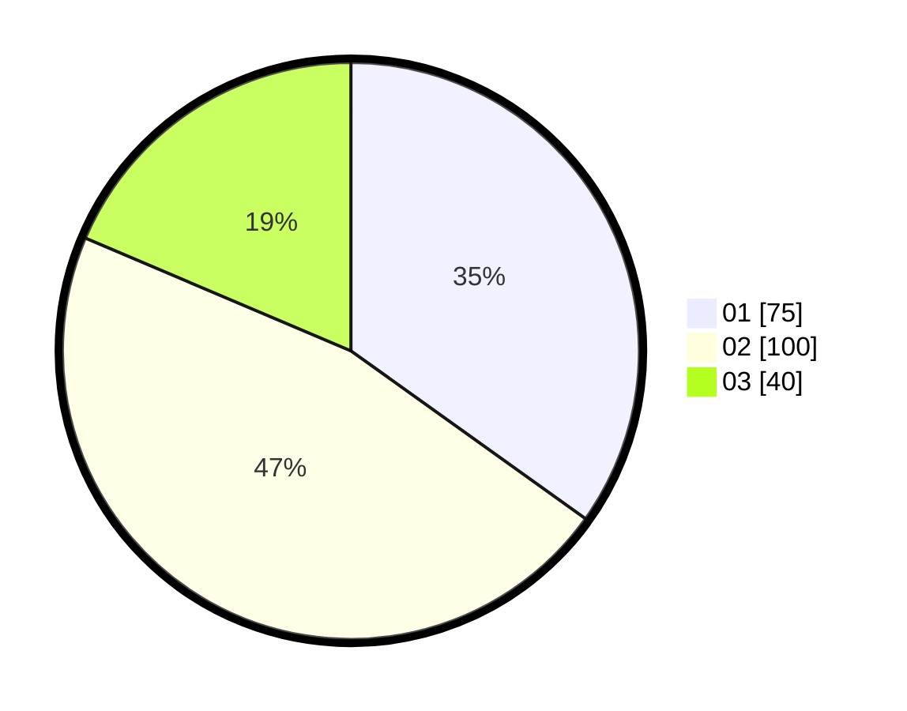

# Hasil

Hasil perolehan suara paslon dapat dilihat pada file paslon-01.txt, paslon-02.txt, dan paslon-03.txt.

Jika tidak ada, artinya data tersebut belum ada pada SIREKAP.

## Perolehan Suara

 * Paslon 01: **75**.
 * Paslon 02: **100**.
 * Paslon 03: **40**.

## Foto C Plano

https://sirekap-obj-formc.kpu.go.id/62de/pemilu/ppwp/31/75/09/10/01/3175091001170-20240215-162649--660cdaf3-9cfd-43c6-a3dc-6b5d5fbe4383.jpg

https://sirekap-obj-formc.kpu.go.id/62de/pemilu/ppwp/31/75/09/10/01/3175091001170-20240216-142852--d7c4aa77-5f03-41a8-960c-25befebc5502.jpg

https://sirekap-obj-formc.kpu.go.id/62de/pemilu/ppwp/31/75/09/10/01/3175091001170-20240216-143026--6f6ab7bd-ad47-427c-82f3-d710530a0c2c.jpg

## DATA PEMILIH TETAP

Jumlah pemilih dalam DPT: **262**.
 * L: **120**.
 * P: **142**.

## DATA PENGGUNA HAK PILIH

Jumlah pengguna hak pilih dalam DPT: **218**.
 * L: **97**.
 * P: **121**.

Jumlah pengguna hak pilih dalam DPTb: **0**.
 * L: **0**.
 * P: **0**.

Jumlah pengguna hak pilih dalam DPK: **0**.
 * L: **0**.
 * P: **0**.

Jumlah pengguna hak pilih: **218**.
 * L: **97**.
 * P: **121**.

## JUMLAH SUARA SAH DAN TIDAK SAH

JUMLAH SELURUH SUARA SAH: **215**.

JUMLAH SUARA TIDAK SAH: **3**.

JUMLAH SELURUH SUARA SAH DAN SUARA TIDAK SAH: **218**.
