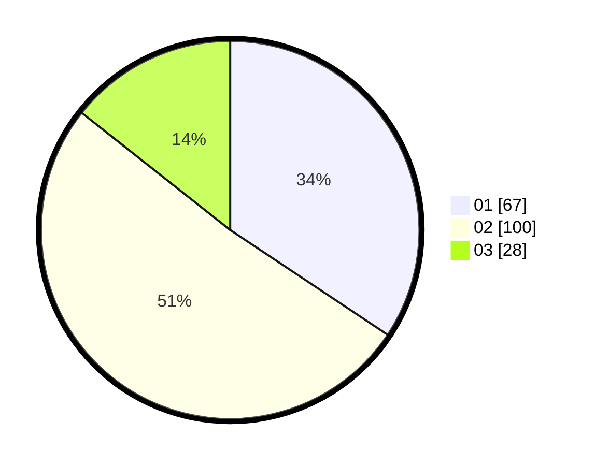

# Hasil

Hasil perolehan suara paslon dapat dilihat pada file paslon-01.txt, paslon-02.txt, dan paslon-03.txt.

Jika tidak ada, artinya data tersebut belum ada pada SIREKAP.

## Perolehan Suara

 * Paslon 01: **67**.
 * Paslon 02: **100**.
 * Paslon 03: **28**.

## Foto C Plano

https://sirekap-obj-formc.kpu.go.id/b0fe/pemilu/ppwp/31/75/09/10/01/3175091001174-20240216-145428--a47dfc16-f5f7-4e04-a9c6-3755a6dea638.jpg

https://sirekap-obj-formc.kpu.go.id/b0fe/pemilu/ppwp/31/75/09/10/01/3175091001174-20240216-145436--c5fc07b4-c659-4950-a9d5-cf8de0a875ab.jpg

https://sirekap-obj-formc.kpu.go.id/b0fe/pemilu/ppwp/31/75/09/10/01/3175091001174-20240216-145435--d1d3c0c1-7c86-4b0f-b5e7-33f63947772b.jpg

## DATA PEMILIH TETAP

Jumlah pemilih dalam DPT: **262**.
 * L: **132**.
 * P: **130**.

## DATA PENGGUNA HAK PILIH

Jumlah pengguna hak pilih dalam DPT: **183**.
 * L: **86**.
 * P: **97**.

Jumlah pengguna hak pilih dalam DPTb: **12**.
 * L: **9**.
 * P: **3**.

Jumlah pengguna hak pilih dalam DPK: **0**.
 * L: **0**.
 * P: **0**.

Jumlah pengguna hak pilih: **195**.
 * L: **95**.
 * P: **100**.

## JUMLAH SUARA SAH DAN TIDAK SAH

JUMLAH SELURUH SUARA SAH: **195**.

JUMLAH SUARA TIDAK SAH: **0**.

JUMLAH SELURUH SUARA SAH DAN SUARA TIDAK SAH: **195**.
