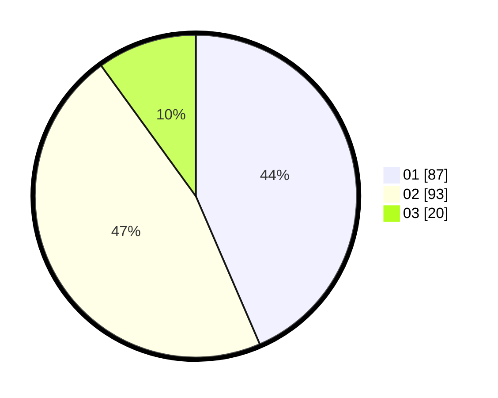

# Hasil

Hasil perolehan suara paslon dapat dilihat pada file paslon-01.txt, paslon-02.txt, dan paslon-03.txt.

Jika tidak ada, artinya data tersebut belum ada pada SIREKAP.

## Perolehan Suara

 * Paslon 01: **87**.
 * Paslon 02: **93**.
 * Paslon 03: **20**.

## Foto C Plano

https://sirekap-obj-formc.kpu.go.id/1ba7/pemilu/ppwp/31/75/09/10/01/3175091001179-20240214-215148--b7f34bb9-6f26-4108-a25c-4485cd81ae3f.jpg

https://sirekap-obj-formc.kpu.go.id/1ba7/pemilu/ppwp/31/75/09/10/01/3175091001179-20240214-215245--2d3ce5ce-f1bb-4841-b607-00a055b389ef.jpg

https://sirekap-obj-formc.kpu.go.id/1ba7/pemilu/ppwp/31/75/09/10/01/3175091001179-20240214-215614--9a681adb-aed7-437a-b557-3a915a93d05f.jpg
