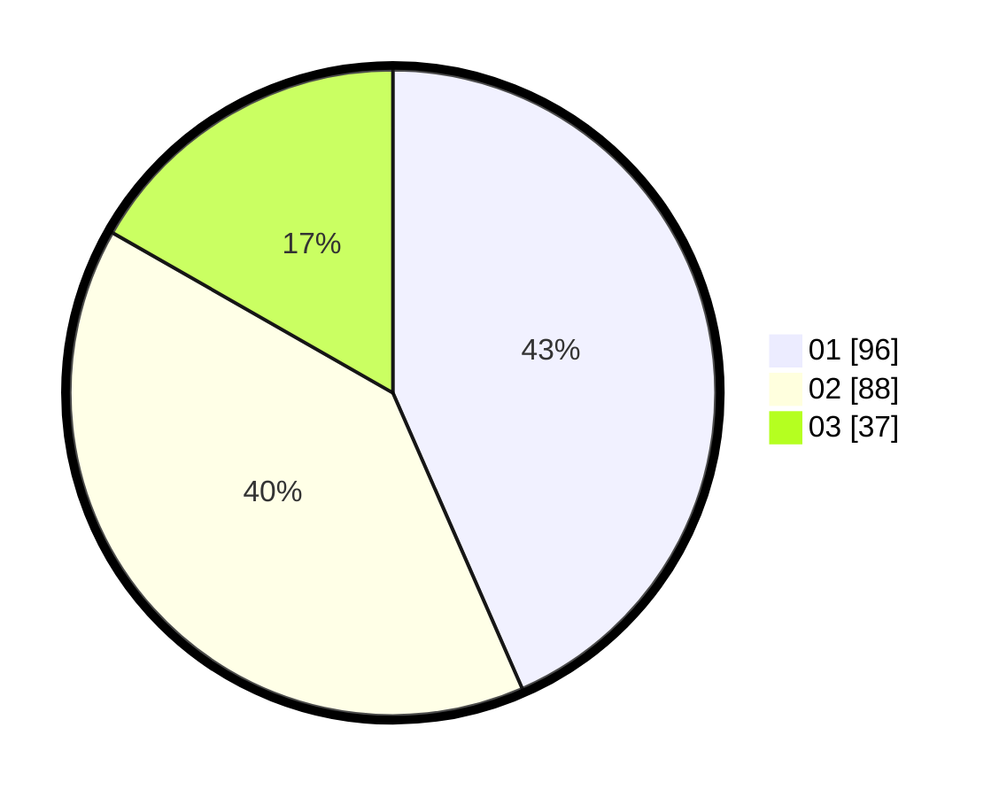

# Hasil

Hasil perolehan suara paslon dapat dilihat pada file paslon-01.txt, paslon-02.txt, dan paslon-03.txt.

Jika tidak ada, artinya data tersebut belum ada pada SIREKAP.

## Perolehan Suara

 * Paslon 01: **96**.
 * Paslon 02: **88**.
 * Paslon 03: **37**.

## Foto C Plano

https://sirekap-obj-formc.kpu.go.id/a6a1/pemilu/ppwp/31/75/09/10/01/3175091001181-20240214-210320--1c37ce73-8375-4a1b-b3e8-14ec084a66e9.jpg

https://sirekap-obj-formc.kpu.go.id/a6a1/pemilu/ppwp/31/75/09/10/01/3175091001181-20240214-210650--fe24f7e6-bd68-4097-9137-2323c3db1804.jpg

https://sirekap-obj-formc.kpu.go.id/a6a1/pemilu/ppwp/31/75/09/10/01/3175091001181-20240214-210942--5835f762-44ac-4a8c-af61-c250fd5cde72.jpg

## DATA PEMILIH TETAP

Jumlah pemilih dalam DPT: **257**.
 * L: **128**.
 * P: **129**.

## DATA PENGGUNA HAK PILIH

Jumlah pengguna hak pilih dalam DPT: **219**.
 * L: **107**.
 * P: **112**.

Jumlah pengguna hak pilih dalam DPTb: **2**.
 * L: **2**.
 * P: **0**.

Jumlah pengguna hak pilih dalam DPK: **1**.
 * L: **1**.
 * P: **0**.

Jumlah pengguna hak pilih: **222**.
 * L: **110**.
 * P: **112**.

## JUMLAH SUARA SAH DAN TIDAK SAH

JUMLAH SELURUH SUARA SAH: **221**.

JUMLAH SUARA TIDAK SAH: **1**.

JUMLAH SELURUH SUARA SAH DAN SUARA TIDAK SAH: **222**.
