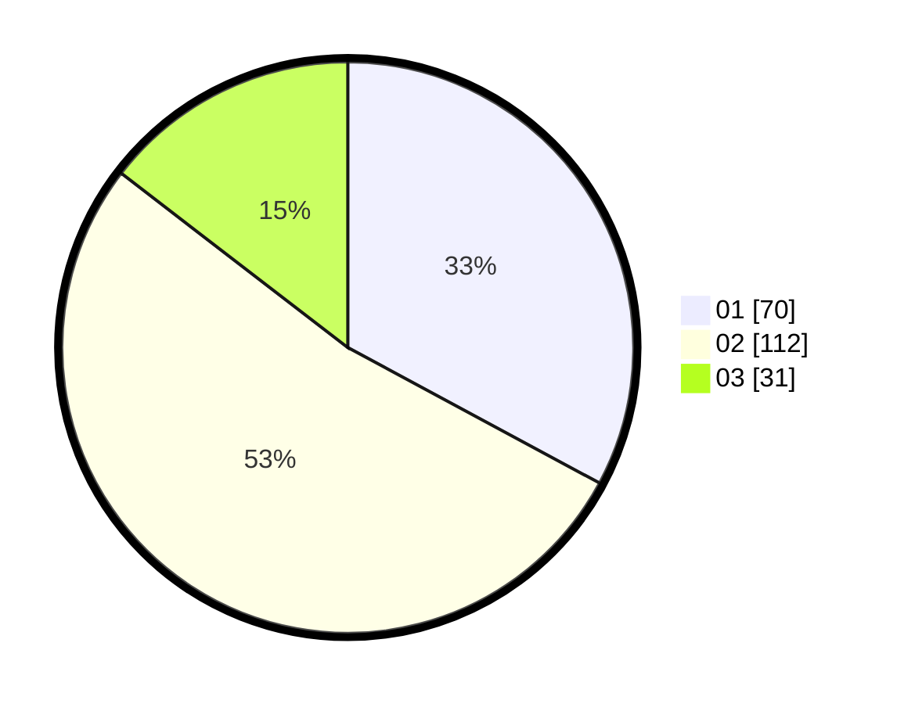

# Hasil

Hasil perolehan suara paslon dapat dilihat pada file paslon-01.txt, paslon-02.txt, dan paslon-03.txt.

Jika tidak ada, artinya data tersebut belum ada pada SIREKAP.

## Perolehan Suara

 * Paslon 01: **70**.
 * Paslon 02: **112**.
 * Paslon 03: **31**.

## Foto C Plano

https://sirekap-obj-formc.kpu.go.id/f40d/pemilu/ppwp/31/75/09/10/01/3175091001182-20240214-194226--27654340-a04e-4b17-8d97-87f9a667eecf.jpg

https://sirekap-obj-formc.kpu.go.id/f40d/pemilu/ppwp/31/75/09/10/01/3175091001182-20240214-194336--4301b09b-f847-4496-b5a9-401d73df73c1.jpg

https://sirekap-obj-formc.kpu.go.id/f40d/pemilu/ppwp/31/75/09/10/01/3175091001182-20240214-201813--716a8549-73f1-4aa8-964d-ea7fe97f3efb.jpg

## DATA PEMILIH TETAP

Jumlah pemilih dalam DPT: **273**.
 * L: **129**.
 * P: **144**.

## DATA PENGGUNA HAK PILIH

Jumlah pengguna hak pilih dalam DPT: **217**.
 * L: **96**.
 * P: **121**.

Jumlah pengguna hak pilih dalam DPTb: **0**.
 * L: **0**.
 * P: **0**.

Jumlah pengguna hak pilih dalam DPK: **0**.
 * L: **0**.
 * P: **0**.

Jumlah pengguna hak pilih: **217**.
 * L: **96**.
 * P: **121**.

## JUMLAH SUARA SAH DAN TIDAK SAH

JUMLAH SELURUH SUARA SAH: **213**.

JUMLAH SUARA TIDAK SAH: **4**.

JUMLAH SELURUH SUARA SAH DAN SUARA TIDAK SAH: **217**.
