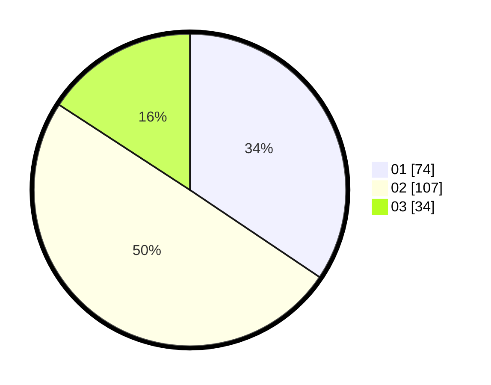

# Hasil

Hasil perolehan suara paslon dapat dilihat pada file paslon-01.txt, paslon-02.txt, dan paslon-03.txt.

Jika tidak ada, artinya data tersebut belum ada pada SIREKAP.

## Perolehan Suara

 * Paslon 01: **74**.
 * Paslon 02: **107**.
 * Paslon 03: **34**.

## Foto C Plano

https://sirekap-obj-formc.kpu.go.id/0201/pemilu/ppwp/31/75/09/10/01/3175091001184-20240216-134809--364cdbbd-c1d6-4716-a738-6ea27a5609d8.jpg

https://sirekap-obj-formc.kpu.go.id/0201/pemilu/ppwp/31/75/09/10/01/3175091001184-20240216-134810--d58d7eda-4ad7-48e9-84d8-2120f10af3cb.jpg

https://sirekap-obj-formc.kpu.go.id/0201/pemilu/ppwp/31/75/09/10/01/3175091001184-20240216-134809--11eceb7a-5afe-4554-ab3a-13f8e22df2d5.jpg

## DATA PEMILIH TETAP

Jumlah pemilih dalam DPT: **272**.
 * L: **139**.
 * P: **133**.

## DATA PENGGUNA HAK PILIH

Jumlah pengguna hak pilih dalam DPT: **221**.
 * L: **107**.
 * P: **114**.

Jumlah pengguna hak pilih dalam DPTb: **0**.
 * L: **0**.
 * P: **0**.

Jumlah pengguna hak pilih dalam DPK: **0**.
 * L: **0**.
 * P: **0**.

Jumlah pengguna hak pilih: **221**.
 * L: **107**.
 * P: **114**.

## JUMLAH SUARA SAH DAN TIDAK SAH

JUMLAH SELURUH SUARA SAH: **215**.

JUMLAH SUARA TIDAK SAH: **6**.

JUMLAH SELURUH SUARA SAH DAN SUARA TIDAK SAH: **221**.
