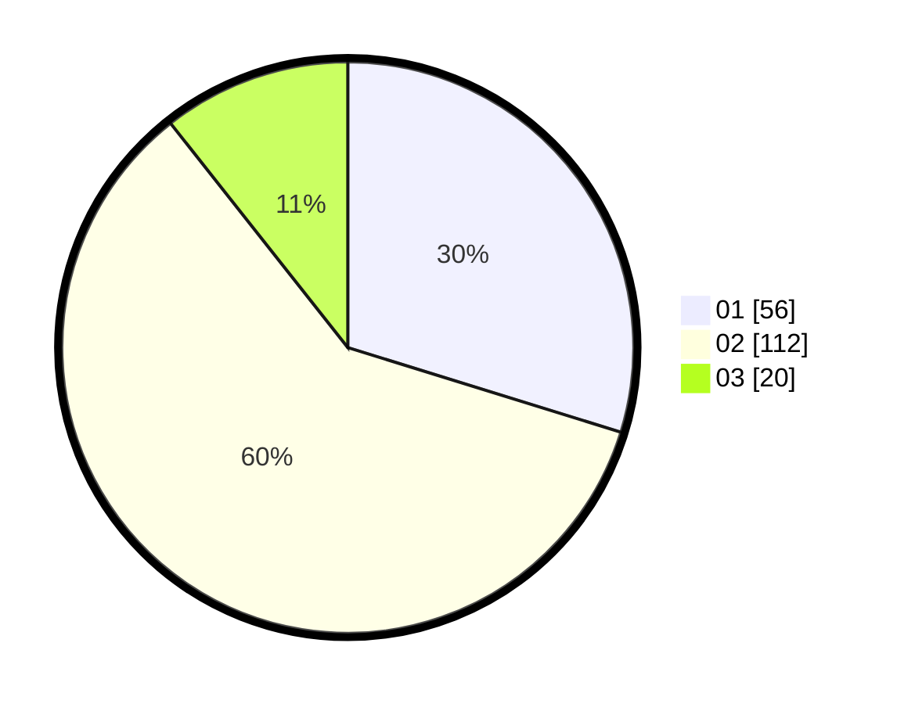

# Hasil

Hasil perolehan suara paslon dapat dilihat pada file paslon-01.txt, paslon-02.txt, dan paslon-03.txt.

Jika tidak ada, artinya data tersebut belum ada pada SIREKAP.

## Perolehan Suara

 * Paslon 01: **56**.
 * Paslon 02: **112**.
 * Paslon 03: **20**.

## Foto C Plano

https://sirekap-obj-formc.kpu.go.id/e42b/pemilu/ppwp/31/75/09/10/01/3175091001188-20240214-214624--b477bf78-133d-4376-b894-c706d091c2a8.jpg

https://sirekap-obj-formc.kpu.go.id/e42b/pemilu/ppwp/31/75/09/10/01/3175091001188-20240214-214727--edae5d67-8c1e-450e-8230-7f73994e1fd2.jpg

https://sirekap-obj-formc.kpu.go.id/e42b/pemilu/ppwp/31/75/09/10/01/3175091001188-20240214-190813--f51db472-6fd0-45e0-bc60-160764a83d34.jpg

## DATA PEMILIH TETAP

Jumlah pemilih dalam DPT: **244**.
 * L: **118**.
 * P: **126**.

## DATA PENGGUNA HAK PILIH

Jumlah pengguna hak pilih dalam DPT: **185**.
 * L: **86**.
 * P: **99**.

Jumlah pengguna hak pilih dalam DPTb: **0**.
 * L: **0**.
 * P: **0**.

Jumlah pengguna hak pilih dalam DPK: **5**.
 * L: **3**.
 * P: **2**.

Jumlah pengguna hak pilih: **190**.
 * L: **89**.
 * P: **101**.

## JUMLAH SUARA SAH DAN TIDAK SAH

JUMLAH SELURUH SUARA SAH: **188**.

JUMLAH SUARA TIDAK SAH: **2**.

JUMLAH SELURUH SUARA SAH DAN SUARA TIDAK SAH: **190**.
