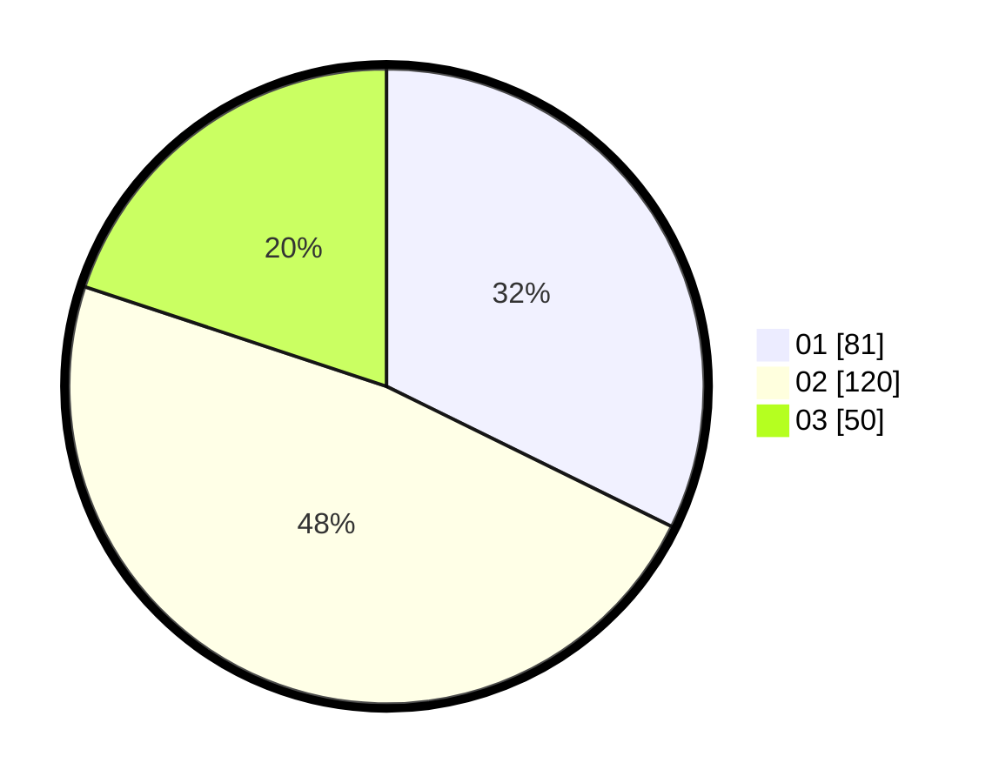

# Hasil

Hasil perolehan suara paslon dapat dilihat pada file paslon-01.txt, paslon-02.txt, dan paslon-03.txt.

Jika tidak ada, artinya data tersebut belum ada pada SIREKAP.

## Perolehan Suara

 * Paslon 01: **81**.
 * Paslon 02: **120**.
 * Paslon 03: **50**.

## Foto C Plano

https://sirekap-obj-formc.kpu.go.id/baf7/pemilu/ppwp/31/75/09/10/01/3175091001189-20240214-231209--5ae8eb34-9b71-4d25-91e7-f9a1da88a71d.jpg

https://sirekap-obj-formc.kpu.go.id/baf7/pemilu/ppwp/31/75/09/10/01/3175091001189-20240214-205403--d6b1d762-bca3-4961-bf62-8fc3c1320add.jpg

https://sirekap-obj-formc.kpu.go.id/baf7/pemilu/ppwp/31/75/09/10/01/3175091001189-20240214-205522--0f78b2c4-a11a-4260-9d77-250ad36a063a.jpg

## DATA PEMILIH TETAP

Jumlah pemilih dalam DPT: **290**.
 * L: **150**.
 * P: **140**.

## DATA PENGGUNA HAK PILIH

Jumlah pengguna hak pilih dalam DPT: **232**.
 * L: **109**.
 * P: **123**.

Jumlah pengguna hak pilih dalam DPTb: **3**.
 * L: **1**.
 * P: **2**.

Jumlah pengguna hak pilih dalam DPK: **8**.
 * L: **4**.
 * P: **4**.

Jumlah pengguna hak pilih: **234**.
 * L: **114**.
 * P: **129**.

## JUMLAH SUARA SAH DAN TIDAK SAH

JUMLAH SELURUH SUARA SAH: **251**.

JUMLAH SUARA TIDAK SAH: **3**.

JUMLAH SELURUH SUARA SAH DAN SUARA TIDAK SAH: **254**.
