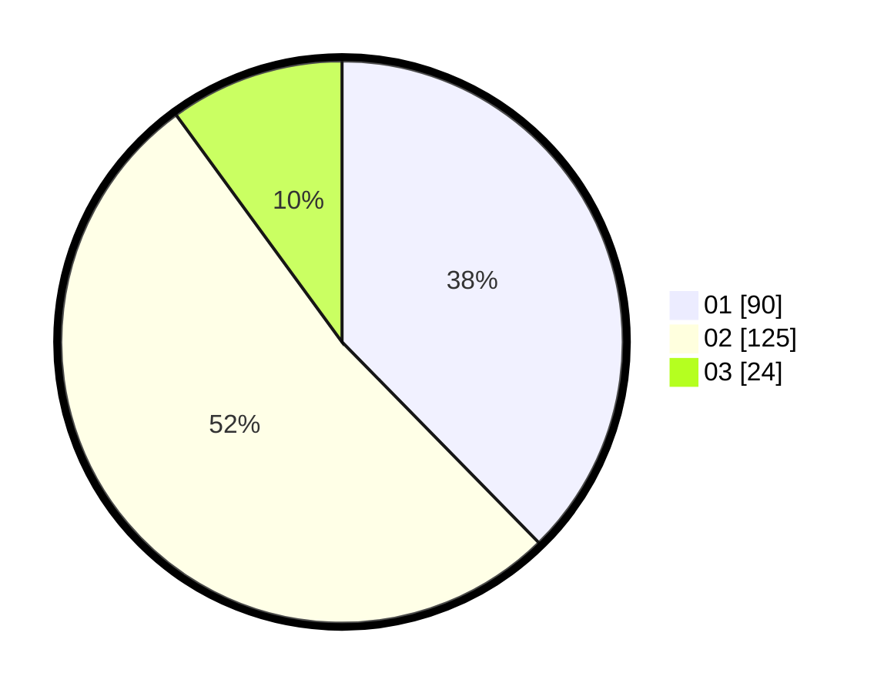

# Hasil

Hasil perolehan suara paslon dapat dilihat pada file paslon-01.txt, paslon-02.txt, dan paslon-03.txt.

Jika tidak ada, artinya data tersebut belum ada pada SIREKAP.

## Perolehan Suara

 * Paslon 01: **90**.
 * Paslon 02: **125**.
 * Paslon 03: **24**.

## Foto C Plano

https://sirekap-obj-formc.kpu.go.id/68d3/pemilu/ppwp/31/75/09/10/01/3175091001190-20240214-220851--4a94ccd3-312e-4eba-a1d7-64039df836aa.jpg

https://sirekap-obj-formc.kpu.go.id/68d3/pemilu/ppwp/31/75/09/10/01/3175091001190-20240216-130139--0e4c3dc9-c31f-4b03-9935-cd00bd691e13.jpg

https://sirekap-obj-formc.kpu.go.id/68d3/pemilu/ppwp/31/75/09/10/01/3175091001190-20240214-184607--f075d7ed-a033-4a2c-97dc-538fae62ef9c.jpg

## DATA PEMILIH TETAP

Jumlah pemilih dalam DPT: **291**.
 * L: **142**.
 * P: **149**.

## DATA PENGGUNA HAK PILIH

Jumlah pengguna hak pilih dalam DPT: **238**.
 * L: **109**.
 * P: **129**.

Jumlah pengguna hak pilih dalam DPTb: **3**.
 * L: **2**.
 * P: **1**.

Jumlah pengguna hak pilih dalam DPK: **0**.
 * L: **0**.
 * P: **0**.

Jumlah pengguna hak pilih: **241**.
 * L: **111**.
 * P: **130**.

## JUMLAH SUARA SAH DAN TIDAK SAH

JUMLAH SELURUH SUARA SAH: **239**.

JUMLAH SUARA TIDAK SAH: **2**.

JUMLAH SELURUH SUARA SAH DAN SUARA TIDAK SAH: **241**.
