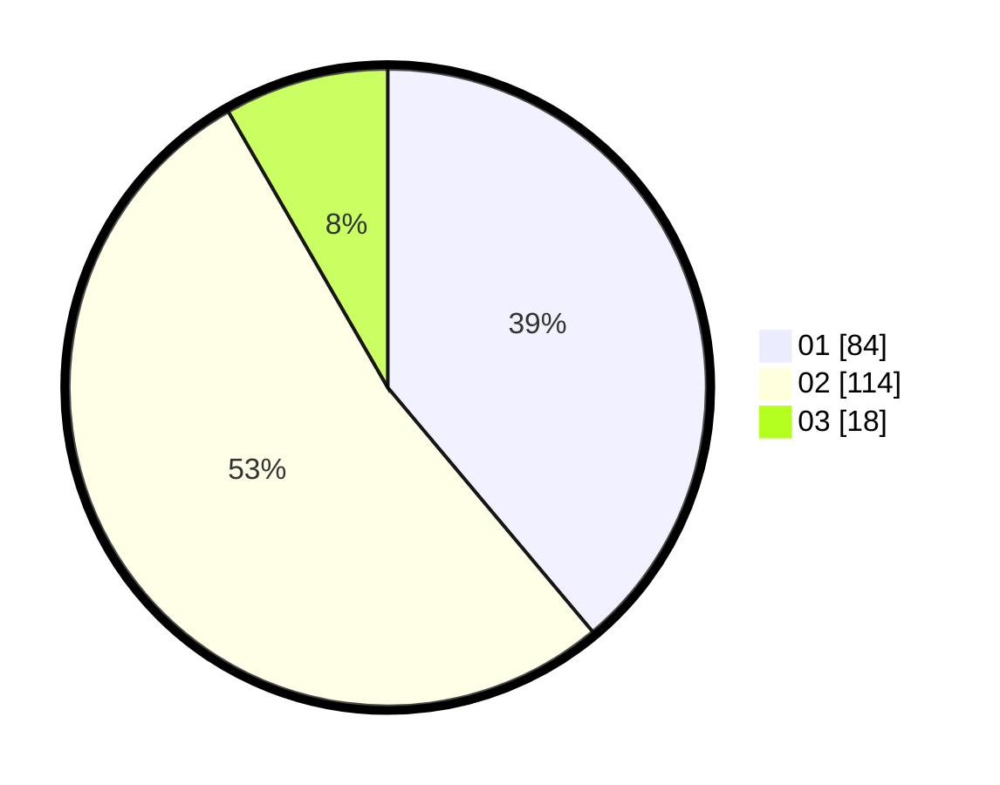

# Hasil

Hasil perolehan suara paslon dapat dilihat pada file paslon-01.txt, paslon-02.txt, dan paslon-03.txt.

Jika tidak ada, artinya data tersebut belum ada pada SIREKAP.

## Perolehan Suara

 * Paslon 01: **84**.
 * Paslon 02: **114**.
 * Paslon 03: **18**.

## Foto C Plano

https://sirekap-obj-formc.kpu.go.id/126d/pemilu/ppwp/31/75/09/10/01/3175091001191-20240217-203600--d68924fa-6f96-4847-b4f7-516b2ca957de.jpg

https://sirekap-obj-formc.kpu.go.id/126d/pemilu/ppwp/31/75/09/10/01/3175091001191-20240217-220621--dcf1e17a-1a58-4313-a10b-f77c0498cb90.jpg

https://sirekap-obj-formc.kpu.go.id/126d/pemilu/ppwp/31/75/09/10/01/3175091001191-20240217-203730--15143ec1-452f-4eb2-af52-21570c3b472a.jpg

## DATA PEMILIH TETAP

Jumlah pemilih dalam DPT: **255**.
 * L: **123**.
 * P: **132**.

## DATA PENGGUNA HAK PILIH

Jumlah pengguna hak pilih dalam DPT: **216**.
 * L: **98**.
 * P: **118**.

Jumlah pengguna hak pilih dalam DPTb: **7**.
 * L: **2**.
 * P: **5**.

Jumlah pengguna hak pilih dalam DPK: **0**.
 * L: **0**.
 * P: **0**.

Jumlah pengguna hak pilih: **223**.
 * L: **100**.
 * P: **123**.

## JUMLAH SUARA SAH DAN TIDAK SAH

JUMLAH SELURUH SUARA SAH: **216**.

JUMLAH SUARA TIDAK SAH: **7**.

JUMLAH SELURUH SUARA SAH DAN SUARA TIDAK SAH: **223**.
