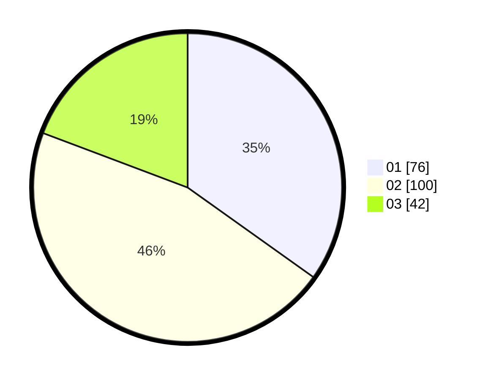

# Hasil

Hasil perolehan suara paslon dapat dilihat pada file paslon-01.txt, paslon-02.txt, dan paslon-03.txt.

Jika tidak ada, artinya data tersebut belum ada pada SIREKAP.

## Perolehan Suara

 * Paslon 01: **76**.
 * Paslon 02: **100**.
 * Paslon 03: **42**.

## Foto C Plano

https://sirekap-obj-formc.kpu.go.id/c4bd/pemilu/ppwp/31/75/09/10/01/3175091001196-20240216-162301--0fcba146-ad31-4d68-826c-c787cc6f6354.jpg

https://sirekap-obj-formc.kpu.go.id/c4bd/pemilu/ppwp/31/75/09/10/01/3175091001196-20240216-162411--e2d89d10-95e2-43f9-a578-b5b01729a634.jpg

https://sirekap-obj-formc.kpu.go.id/c4bd/pemilu/ppwp/31/75/09/10/01/3175091001196-20240216-163126--42d2df92-579b-4ecf-91b5-62a8cc11d264.jpg

## DATA PEMILIH TETAP

Jumlah pemilih dalam DPT: **283**.
 * L: **128**.
 * P: **155**.

## DATA PENGGUNA HAK PILIH

Jumlah pengguna hak pilih dalam DPT: **217**.
 * L: **95**.
 * P: **122**.

Jumlah pengguna hak pilih dalam DPTb: **0**.
 * L: **0**.
 * P: **0**.

Jumlah pengguna hak pilih dalam DPK: **7**.
 * L: **2**.
 * P: **5**.

Jumlah pengguna hak pilih: **224**.
 * L: **97**.
 * P: **127**.

## JUMLAH SUARA SAH DAN TIDAK SAH

JUMLAH SELURUH SUARA SAH: **218**.

JUMLAH SUARA TIDAK SAH: **7**.

JUMLAH SELURUH SUARA SAH DAN SUARA TIDAK SAH: **225**.
