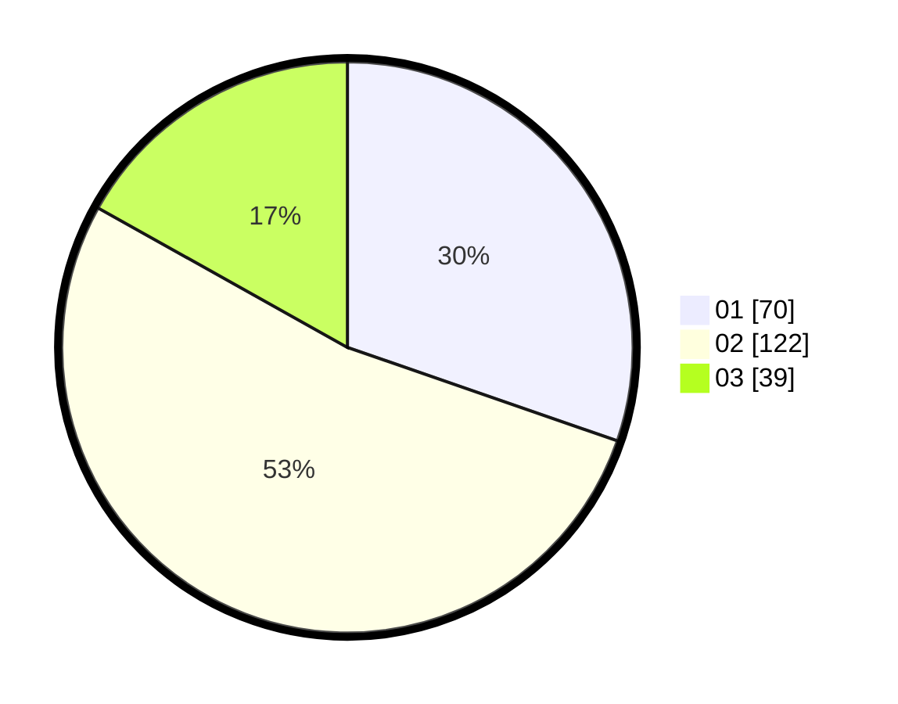

# Hasil

Hasil perolehan suara paslon dapat dilihat pada file paslon-01.txt, paslon-02.txt, dan paslon-03.txt.

Jika tidak ada, artinya data tersebut belum ada pada SIREKAP.

## Perolehan Suara

 * Paslon 01: **70**.
 * Paslon 02: **122**.
 * Paslon 03: **39**.

## Foto C Plano

https://sirekap-obj-formc.kpu.go.id/1efc/pemilu/ppwp/31/75/09/10/01/3175091001199-20240215-004200--7b6f0ec5-94b7-4d2e-8cfb-8cc798784b28.jpg

https://sirekap-obj-formc.kpu.go.id/1efc/pemilu/ppwp/31/75/09/10/01/3175091001199-20240216-131059--6cbe7495-ab85-4561-a597-2a7bdb41daf3.jpg

https://sirekap-obj-formc.kpu.go.id/1efc/pemilu/ppwp/31/75/09/10/01/3175091001199-20240216-181110--a3c5dbbb-43c7-4975-95dc-b3ad5c81cc99.jpg

## DATA PEMILIH TETAP

Jumlah pemilih dalam DPT: **261**.
 * L: **124**.
 * P: **137**.

## DATA PENGGUNA HAK PILIH

Jumlah pengguna hak pilih dalam DPT: **220**.
 * L: **100**.
 * P: **120**.

Jumlah pengguna hak pilih dalam DPTb: **3**.
 * L: **2**.
 * P: **1**.

Jumlah pengguna hak pilih dalam DPK: **10**.
 * L: **5**.
 * P: **5**.

Jumlah pengguna hak pilih: **233**.
 * L: **107**.
 * P: **126**.

## JUMLAH SUARA SAH DAN TIDAK SAH

JUMLAH SELURUH SUARA SAH: **231**.

JUMLAH SUARA TIDAK SAH: **2**.

JUMLAH SELURUH SUARA SAH DAN SUARA TIDAK SAH: **233**.
