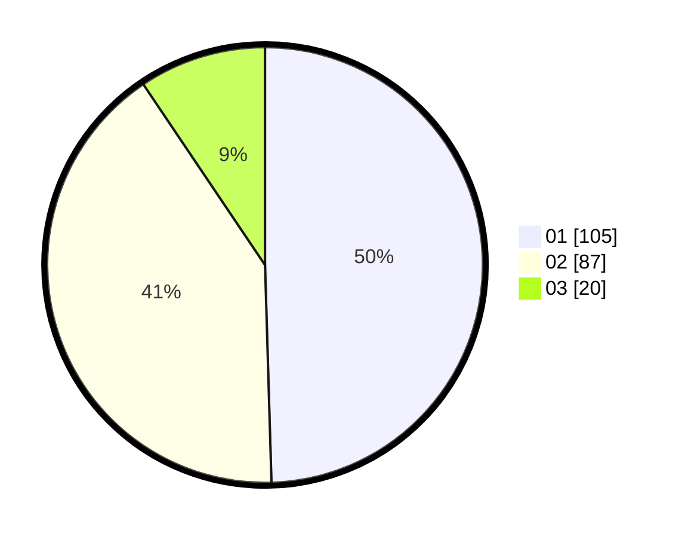

# Hasil

Hasil perolehan suara paslon dapat dilihat pada file paslon-01.txt, paslon-02.txt, dan paslon-03.txt.

Jika tidak ada, artinya data tersebut belum ada pada SIREKAP.

## Perolehan Suara

 * Paslon 01: **105**.
 * Paslon 02: **87**.
 * Paslon 03: **20**.

## Foto C Plano

https://sirekap-obj-formc.kpu.go.id/1bbb/pemilu/ppwp/31/75/09/10/01/3175091001205-20240216-151609--d1963f63-8cf1-4051-83db-7cf176061def.jpg

https://sirekap-obj-formc.kpu.go.id/1bbb/pemilu/ppwp/31/75/09/10/01/3175091001205-20240216-151611--53fec718-f1c4-4077-9a83-c3b6bb21dc69.jpg

https://sirekap-obj-formc.kpu.go.id/1bbb/pemilu/ppwp/31/75/09/10/01/3175091001205-20240216-151610--811181e1-dcbc-4847-80ef-cc98f8b68778.jpg

## DATA PEMILIH TETAP

Jumlah pemilih dalam DPT: **271**.
 * L: **129**.
 * P: **142**.

## DATA PENGGUNA HAK PILIH

Jumlah pengguna hak pilih dalam DPT: **217**.
 * L: **103**.
 * P: **114**.

Jumlah pengguna hak pilih dalam DPTb: **1**.
 * L: **0**.
 * P: **1**.

Jumlah pengguna hak pilih dalam DPK: **0**.
 * L: **0**.
 * P: **0**.

Jumlah pengguna hak pilih: **218**.
 * L: **103**.
 * P: **115**.

## JUMLAH SUARA SAH DAN TIDAK SAH

JUMLAH SELURUH SUARA SAH: **212**.

JUMLAH SUARA TIDAK SAH: **6**.

JUMLAH SELURUH SUARA SAH DAN SUARA TIDAK SAH: **218**.
