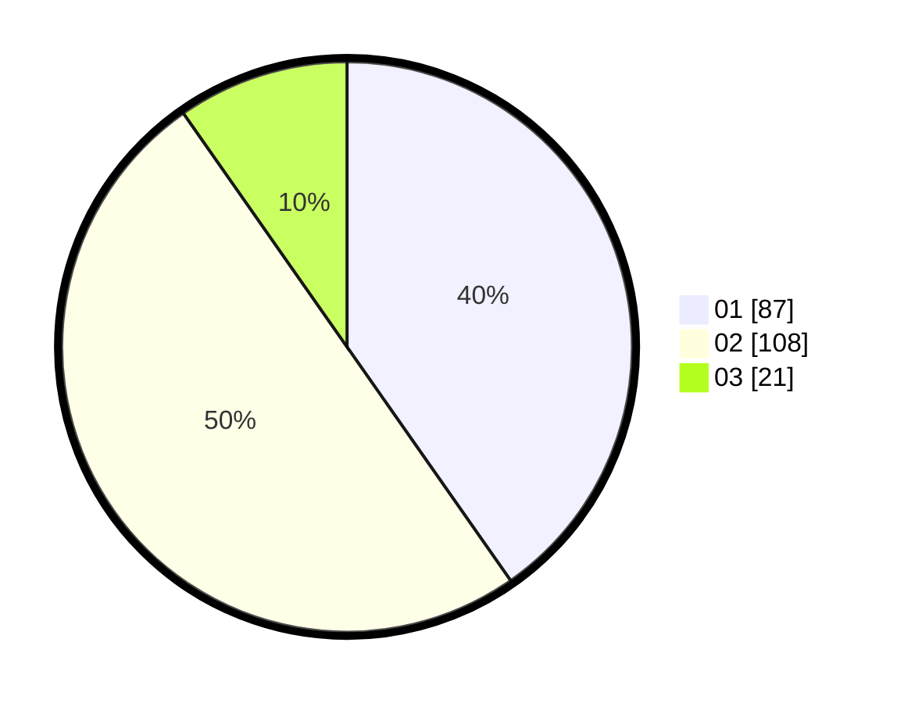

# Hasil

Hasil perolehan suara paslon dapat dilihat pada file paslon-01.txt, paslon-02.txt, dan paslon-03.txt.

Jika tidak ada, artinya data tersebut belum ada pada SIREKAP.

## Perolehan Suara

 * Paslon 01: **87**.
 * Paslon 02: **108**.
 * Paslon 03: **21**.

## Foto C Plano

https://sirekap-obj-formc.kpu.go.id/5793/pemilu/ppwp/31/75/09/10/01/3175091001209-20240214-191414--0dd1e8c9-36dc-4ae4-ac9a-19d3e27abe61.jpg

https://sirekap-obj-formc.kpu.go.id/5793/pemilu/ppwp/31/75/09/10/01/3175091001209-20240214-232637--2b6e7823-356b-40f5-930c-7515e5141d64.jpg

https://sirekap-obj-formc.kpu.go.id/5793/pemilu/ppwp/31/75/09/10/01/3175091001209-20240214-232733--f1b73d98-559c-4cfa-aa46-e814c5c730d7.jpg

## DATA PEMILIH TETAP

Jumlah pemilih dalam DPT: **269**.
 * L: **130**.
 * P: **139**.

## DATA PENGGUNA HAK PILIH

Jumlah pengguna hak pilih dalam DPT: **211**.
 * L: **95**.
 * P: **116**.

Jumlah pengguna hak pilih dalam DPTb: **0**.
 * L: **0**.
 * P: **0**.

Jumlah pengguna hak pilih dalam DPK: **8**.
 * L: **4**.
 * P: **4**.

Jumlah pengguna hak pilih: **219**.
 * L: **99**.
 * P: **120**.

## JUMLAH SUARA SAH DAN TIDAK SAH

JUMLAH SELURUH SUARA SAH: **216**.

JUMLAH SUARA TIDAK SAH: **3**.

JUMLAH SELURUH SUARA SAH DAN SUARA TIDAK SAH: **219**.
