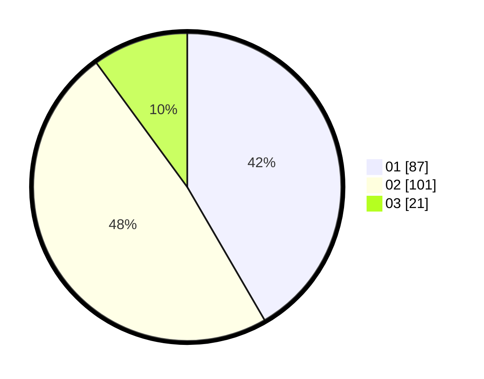

# Hasil

Hasil perolehan suara paslon dapat dilihat pada file paslon-01.txt, paslon-02.txt, dan paslon-03.txt.

Jika tidak ada, artinya data tersebut belum ada pada SIREKAP.

## Perolehan Suara

 * Paslon 01: **87**.
 * Paslon 02: **101**.
 * Paslon 03: **21**.

## Foto C Plano

https://sirekap-obj-formc.kpu.go.id/00e8/pemilu/ppwp/31/75/09/10/01/3175091001212-20240216-220635--77ef0603-a61f-47e3-9f06-4dac879b4545.jpg

https://sirekap-obj-formc.kpu.go.id/00e8/pemilu/ppwp/31/75/09/10/01/3175091001212-20240216-224105--51431cc6-4408-4f34-9800-5edca2f42c18.jpg

https://sirekap-obj-formc.kpu.go.id/00e8/pemilu/ppwp/31/75/09/10/01/3175091001212-20240214-231756--a8bd703a-3dfd-416b-a867-40d6e6afe038.jpg

## DATA PEMILIH TETAP

Jumlah pemilih dalam DPT: **282**.
 * L: **128**.
 * P: **154**.

## DATA PENGGUNA HAK PILIH

Jumlah pengguna hak pilih dalam DPT: **212**.
 * L: **87**.
 * P: **125**.

Jumlah pengguna hak pilih dalam DPTb: **0**.
 * L: **0**.
 * P: **0**.

Jumlah pengguna hak pilih dalam DPK: **1**.
 * L: **1**.
 * P: **0**.

Jumlah pengguna hak pilih: **213**.
 * L: **88**.
 * P: **125**.

## JUMLAH SUARA SAH DAN TIDAK SAH

JUMLAH SELURUH SUARA SAH: **209**.

JUMLAH SUARA TIDAK SAH: **4**.

JUMLAH SELURUH SUARA SAH DAN SUARA TIDAK SAH: **213**.
