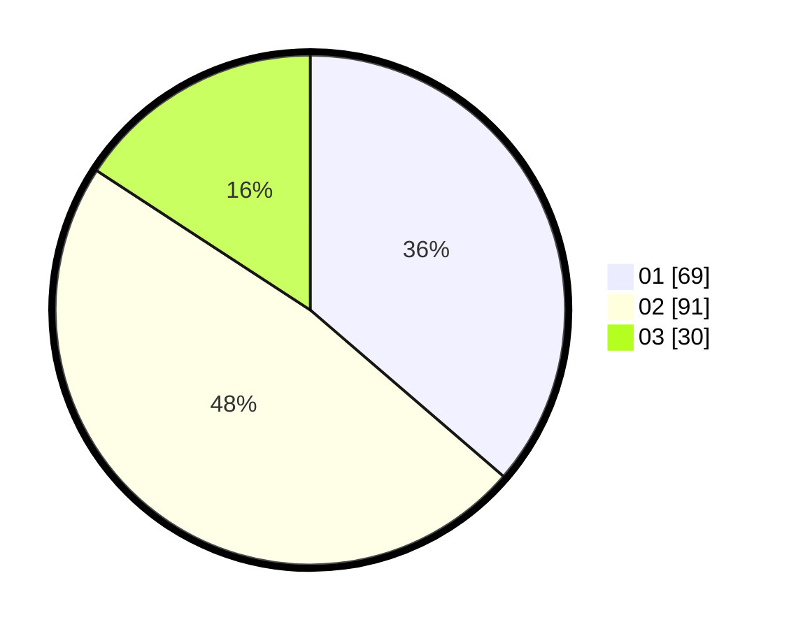

# Hasil

Hasil perolehan suara paslon dapat dilihat pada file paslon-01.txt, paslon-02.txt, dan paslon-03.txt.

Jika tidak ada, artinya data tersebut belum ada pada SIREKAP.

## Perolehan Suara

 * Paslon 01: **69**.
 * Paslon 02: **91**.
 * Paslon 03: **30**.

## Foto C Plano

https://sirekap-obj-formc.kpu.go.id/690f/pemilu/ppwp/31/75/09/10/01/3175091001217-20240215-115143--6b634ebe-7b9d-4af7-b027-1058e761f664.jpg

https://sirekap-obj-formc.kpu.go.id/690f/pemilu/ppwp/31/75/09/10/01/3175091001217-20240214-155728--4fc1d48e-e651-46ff-9ac5-9ee7ee34fd4a.jpg

https://sirekap-obj-formc.kpu.go.id/690f/pemilu/ppwp/31/75/09/10/01/3175091001217-20240214-155829--e12bacfd-01e7-4496-9f4b-f79d62c9e747.jpg

## DATA PEMILIH TETAP

Jumlah pemilih dalam DPT: **243**.
 * L: **116**.
 * P: **127**.

## DATA PENGGUNA HAK PILIH

Jumlah pengguna hak pilih dalam DPT: **193**.
 * L: **92**.
 * P: **101**.

Jumlah pengguna hak pilih dalam DPTb: **0**.
 * L: **0**.
 * P: **0**.

Jumlah pengguna hak pilih dalam DPK: **2**.
 * L: **0**.
 * P: **2**.

Jumlah pengguna hak pilih: **195**.
 * L: **92**.
 * P: **103**.

## JUMLAH SUARA SAH DAN TIDAK SAH

JUMLAH SELURUH SUARA SAH: **190**.

JUMLAH SUARA TIDAK SAH: **5**.

JUMLAH SELURUH SUARA SAH DAN SUARA TIDAK SAH: **195**.
