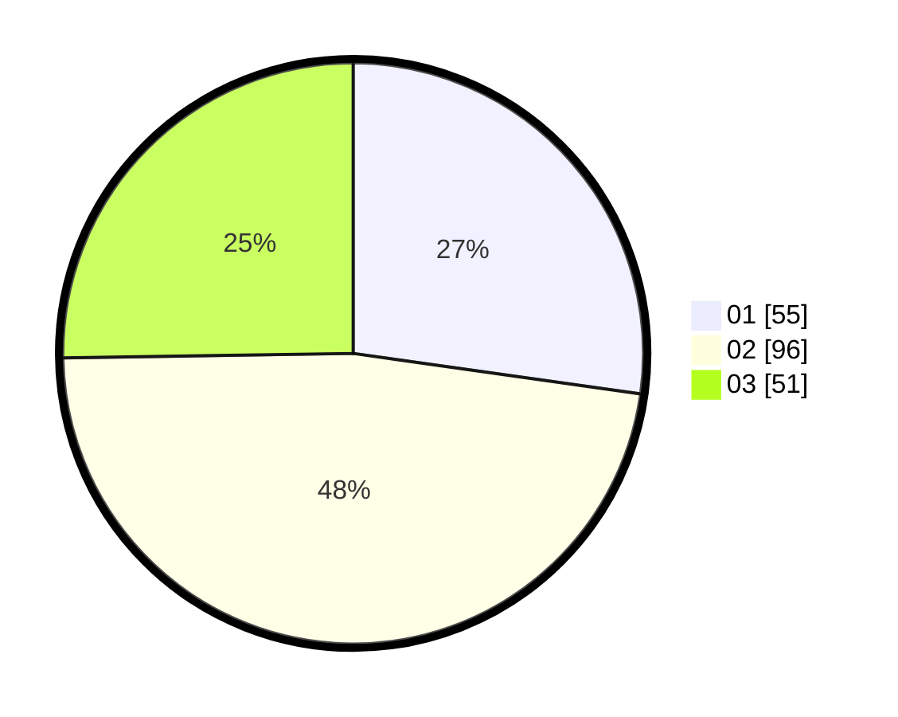

# Hasil

Hasil perolehan suara paslon dapat dilihat pada file paslon-01.txt, paslon-02.txt, dan paslon-03.txt.

Jika tidak ada, artinya data tersebut belum ada pada SIREKAP.

## Perolehan Suara

 * Paslon 01: **55**.
 * Paslon 02: **96**.
 * Paslon 03: **51**.

## Foto C Plano

https://sirekap-obj-formc.kpu.go.id/7390/pemilu/ppwp/31/75/09/10/01/3175091001218-20240214-184535--f45fa70b-15e7-4fb1-b2df-6eee347d3ae4.jpg

https://sirekap-obj-formc.kpu.go.id/7390/pemilu/ppwp/31/75/09/10/01/3175091001218-20240214-185020--3eacde25-92a5-4b70-bd33-4bb53f95baf5.jpg

https://sirekap-obj-formc.kpu.go.id/7390/pemilu/ppwp/31/75/09/10/01/3175091001218-20240214-185309--1d35c551-2068-4da6-9472-07726162e941.jpg

## DATA PEMILIH TETAP

Jumlah pemilih dalam DPT: **260**.
 * L: **127**.
 * P: **133**.

## DATA PENGGUNA HAK PILIH

Jumlah pengguna hak pilih dalam DPT: **204**.
 * L: **96**.
 * P: **108**.

Jumlah pengguna hak pilih dalam DPTb: **0**.
 * L: **0**.
 * P: **0**.

Jumlah pengguna hak pilih dalam DPK: **0**.
 * L: **0**.
 * P: **0**.

Jumlah pengguna hak pilih: **204**.
 * L: **96**.
 * P: **108**.

## JUMLAH SUARA SAH DAN TIDAK SAH

JUMLAH SELURUH SUARA SAH: **202**.

JUMLAH SUARA TIDAK SAH: **2**.

JUMLAH SELURUH SUARA SAH DAN SUARA TIDAK SAH: **204**.
