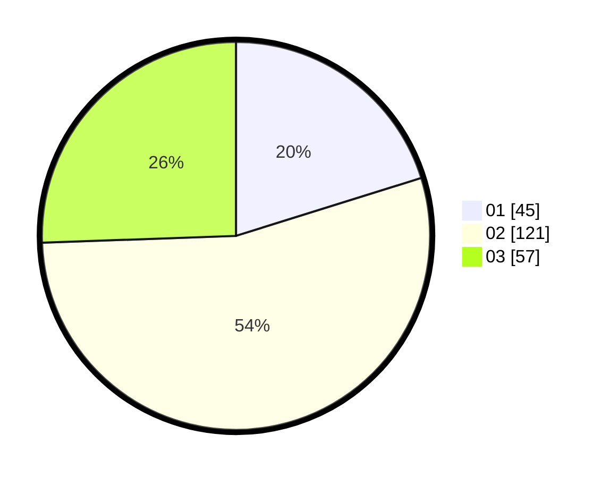

# Hasil

Hasil perolehan suara paslon dapat dilihat pada file paslon-01.txt, paslon-02.txt, dan paslon-03.txt.

Jika tidak ada, artinya data tersebut belum ada pada SIREKAP.

## Perolehan Suara

 * Paslon 01: **45**.
 * Paslon 02: **121**.
 * Paslon 03: **57**.

## Foto C Plano

https://sirekap-obj-formc.kpu.go.id/3f75/pemilu/ppwp/31/75/09/10/02/3175091002001-20240215-001556--231c6dd1-e656-4370-833d-ab15f6021a3e.jpg

https://sirekap-obj-formc.kpu.go.id/3f75/pemilu/ppwp/31/75/09/10/02/3175091002001-20240215-001707--6bb48baf-db34-4d28-9829-80b89158c6d5.jpg

https://sirekap-obj-formc.kpu.go.id/3f75/pemilu/ppwp/31/75/09/10/02/3175091002001-20240215-001916--23b5656b-987f-403e-a2d9-8bdf40102ec3.jpg
