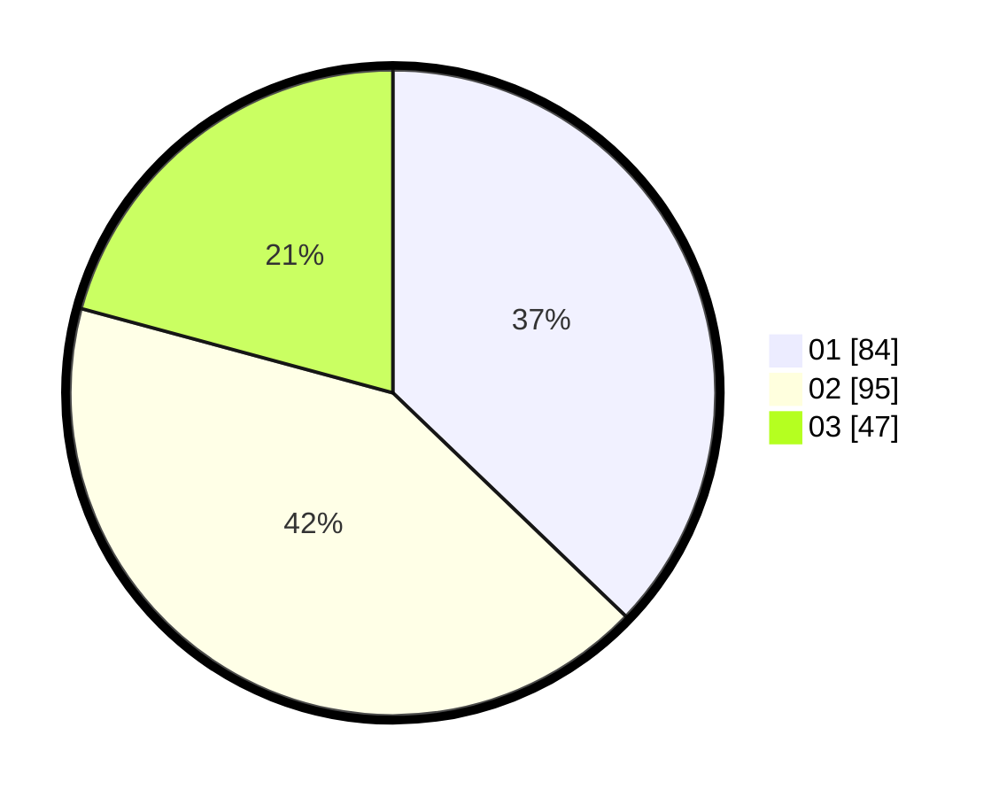

# Hasil

Hasil perolehan suara paslon dapat dilihat pada file paslon-01.txt, paslon-02.txt, dan paslon-03.txt.

Jika tidak ada, artinya data tersebut belum ada pada SIREKAP.

## Perolehan Suara

 * Paslon 01: **84**.
 * Paslon 02: **95**.
 * Paslon 03: **47**.

## Foto C Plano

https://sirekap-obj-formc.kpu.go.id/c917/pemilu/ppwp/31/75/09/10/02/3175091002003-20240216-103807--5e65bc8e-e1e2-4826-b815-64b84c66faab.jpg

https://sirekap-obj-formc.kpu.go.id/c917/pemilu/ppwp/31/75/09/10/02/3175091002003-20240216-104936--3d33e277-ef12-446b-9def-a71183712769.jpg

https://sirekap-obj-formc.kpu.go.id/c917/pemilu/ppwp/31/75/09/10/02/3175091002003-20240216-105630--9b8c0677-708e-4ced-9888-8fc16c9a6d52.jpg

## DATA PEMILIH TETAP

Jumlah pemilih dalam DPT: **268**.
 * L: **139**.
 * P: **129**.

## DATA PENGGUNA HAK PILIH

Jumlah pengguna hak pilih dalam DPT: **224**.
 * L: **112**.
 * P: **112**.

Jumlah pengguna hak pilih dalam DPTb: **0**.
 * L: **0**.
 * P: **0**.

Jumlah pengguna hak pilih dalam DPK: **4**.
 * L: **1**.
 * P: **3**.

Jumlah pengguna hak pilih: **228**.
 * L: **113**.
 * P: **115**.

## JUMLAH SUARA SAH DAN TIDAK SAH

JUMLAH SELURUH SUARA SAH: **226**.

JUMLAH SUARA TIDAK SAH: **2**.

JUMLAH SELURUH SUARA SAH DAN SUARA TIDAK SAH: **228**.
