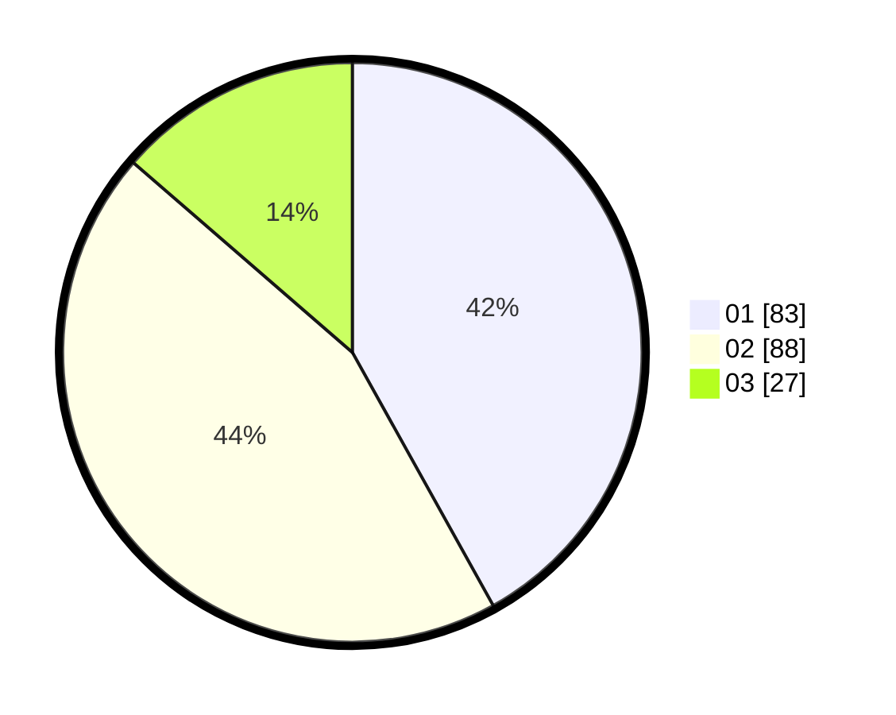

# Hasil

Hasil perolehan suara paslon dapat dilihat pada file paslon-01.txt, paslon-02.txt, dan paslon-03.txt.

Jika tidak ada, artinya data tersebut belum ada pada SIREKAP.

## Perolehan Suara

 * Paslon 01: **83**.
 * Paslon 02: **88**.
 * Paslon 03: **27**.

## Foto C Plano

https://sirekap-obj-formc.kpu.go.id/4011/pemilu/ppwp/31/75/09/10/02/3175091002007-20240214-190841--f5459c72-0f19-42d6-8ce3-1baf7d264c7e.jpg

https://sirekap-obj-formc.kpu.go.id/4011/pemilu/ppwp/31/75/09/10/02/3175091002007-20240214-190922--291ad08d-cab6-4f13-9f48-6dc35b99d5db.jpg

https://sirekap-obj-formc.kpu.go.id/4011/pemilu/ppwp/31/75/09/10/02/3175091002007-20240214-193111--656fcb9e-3e20-44b4-883c-38fab1fc1be5.jpg

## DATA PEMILIH TETAP

Jumlah pemilih dalam DPT: **262**.
 * L: **124**.
 * P: **138**.

## DATA PENGGUNA HAK PILIH

Jumlah pengguna hak pilih dalam DPT: **199**.
 * L: **89**.
 * P: **110**.

Jumlah pengguna hak pilih dalam DPTb: **1**.
 * L: **1**.
 * P: **0**.

Jumlah pengguna hak pilih dalam DPK: **1**.
 * L: **1**.
 * P: **0**.

Jumlah pengguna hak pilih: **201**.
 * L: **91**.
 * P: **110**.

## JUMLAH SUARA SAH DAN TIDAK SAH

JUMLAH SELURUH SUARA SAH: **198**.

JUMLAH SUARA TIDAK SAH: **3**.

JUMLAH SELURUH SUARA SAH DAN SUARA TIDAK SAH: **201**.
