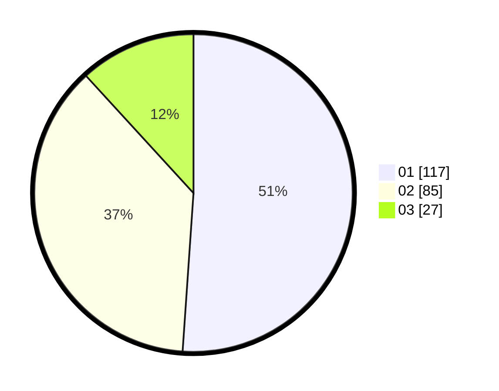

# Hasil

Hasil perolehan suara paslon dapat dilihat pada file paslon-01.txt, paslon-02.txt, dan paslon-03.txt.

Jika tidak ada, artinya data tersebut belum ada pada SIREKAP.

## Perolehan Suara

 * Paslon 01: **117**.
 * Paslon 02: **85**.
 * Paslon 03: **27**.

## Foto C Plano

https://sirekap-obj-formc.kpu.go.id/89c8/pemilu/ppwp/31/75/09/10/02/3175091002012-20240214-204110--445f6374-1e98-46ea-921d-4bc872703d14.jpg

https://sirekap-obj-formc.kpu.go.id/89c8/pemilu/ppwp/31/75/09/10/02/3175091002012-20240214-220552--5373477a-1cad-4d29-a5e7-949cf5711f67.jpg

https://sirekap-obj-formc.kpu.go.id/89c8/pemilu/ppwp/31/75/09/10/02/3175091002012-20240214-220933--b0d554dd-8515-4f85-a42b-9def15035084.jpg
