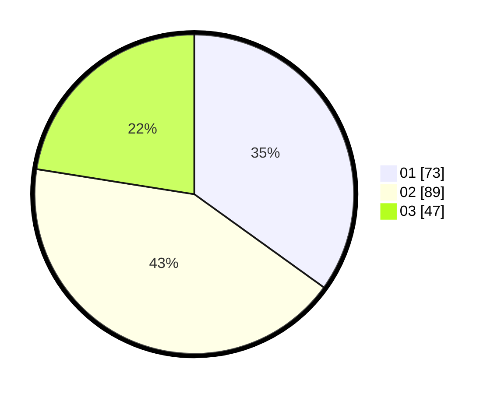

# Hasil

Hasil perolehan suara paslon dapat dilihat pada file paslon-01.txt, paslon-02.txt, dan paslon-03.txt.

Jika tidak ada, artinya data tersebut belum ada pada SIREKAP.

## Perolehan Suara

 * Paslon 01: **73**.
 * Paslon 02: **89**.
 * Paslon 03: **47**.

## Foto C Plano

https://sirekap-obj-formc.kpu.go.id/e11e/pemilu/ppwp/31/75/09/10/02/3175091002013-20240214-225118--539146d3-c22b-4282-a501-63ca0ad45e84.jpg

https://sirekap-obj-formc.kpu.go.id/e11e/pemilu/ppwp/31/75/09/10/02/3175091002013-20240214-225329--b5458477-9ec1-4ffc-9071-2bba58536256.jpg

https://sirekap-obj-formc.kpu.go.id/e11e/pemilu/ppwp/31/75/09/10/02/3175091002013-20240214-225431--d03d2e1f-002d-412c-9b20-f68f4153c2dd.jpg

## DATA PEMILIH TETAP

Jumlah pemilih dalam DPT: **267**.
 * L: **134**.
 * P: **133**.

## DATA PENGGUNA HAK PILIH

Jumlah pengguna hak pilih dalam DPT: **205**.
 * L: **97**.
 * P: **108**.

Jumlah pengguna hak pilih dalam DPTb: **1**.
 * L: **1**.
 * P: **0**.

Jumlah pengguna hak pilih dalam DPK: **6**.
 * L: **4**.
 * P: **2**.

Jumlah pengguna hak pilih: **212**.
 * L: **102**.
 * P: **110**.

## JUMLAH SUARA SAH DAN TIDAK SAH

JUMLAH SELURUH SUARA SAH: **209**.

JUMLAH SUARA TIDAK SAH: **3**.

JUMLAH SELURUH SUARA SAH DAN SUARA TIDAK SAH: **212**.
