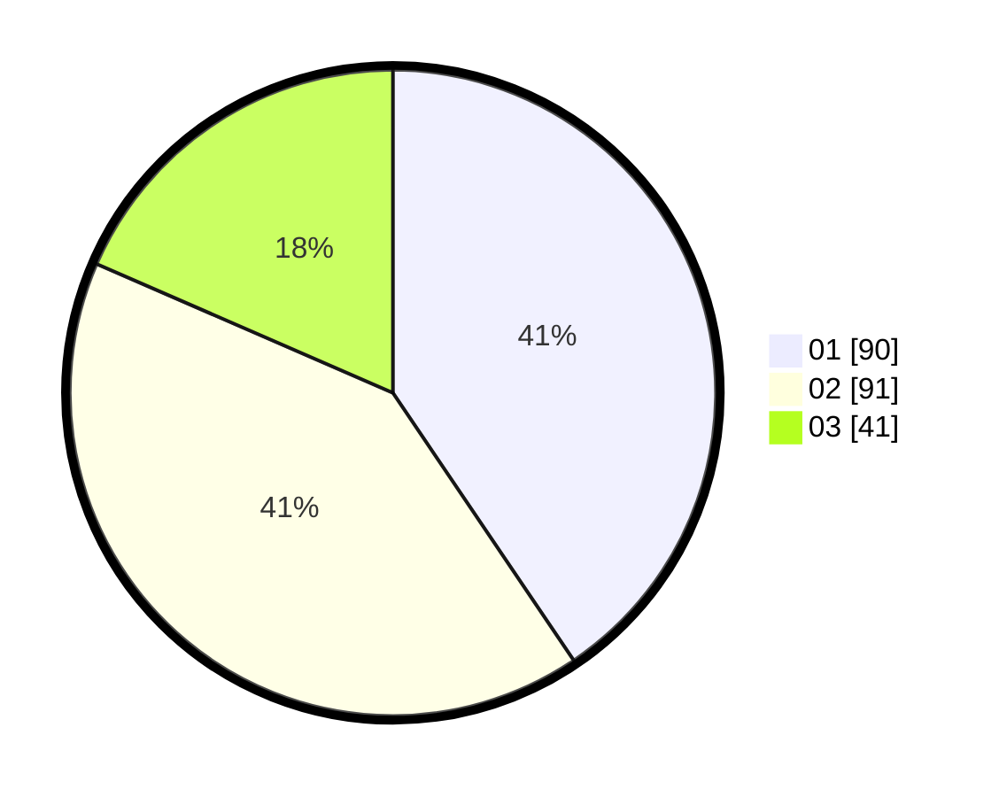

# Hasil

Hasil perolehan suara paslon dapat dilihat pada file paslon-01.txt, paslon-02.txt, dan paslon-03.txt.

Jika tidak ada, artinya data tersebut belum ada pada SIREKAP.

## Perolehan Suara

 * Paslon 01: **90**.
 * Paslon 02: **91**.
 * Paslon 03: **41**.

## Foto C Plano

https://sirekap-obj-formc.kpu.go.id/d0b8/pemilu/ppwp/31/75/09/10/02/3175091002018-20240215-021301--a2b52249-3377-4b23-83b2-c51fc6438351.jpg

https://sirekap-obj-formc.kpu.go.id/d0b8/pemilu/ppwp/31/75/09/10/02/3175091002018-20240214-185756--fd93910b-0b6d-4f80-bce9-5f8677d3a51a.jpg

https://sirekap-obj-formc.kpu.go.id/d0b8/pemilu/ppwp/31/75/09/10/02/3175091002018-20240215-021352--75aa081e-9c85-4001-a48d-9b644e7e470f.jpg
