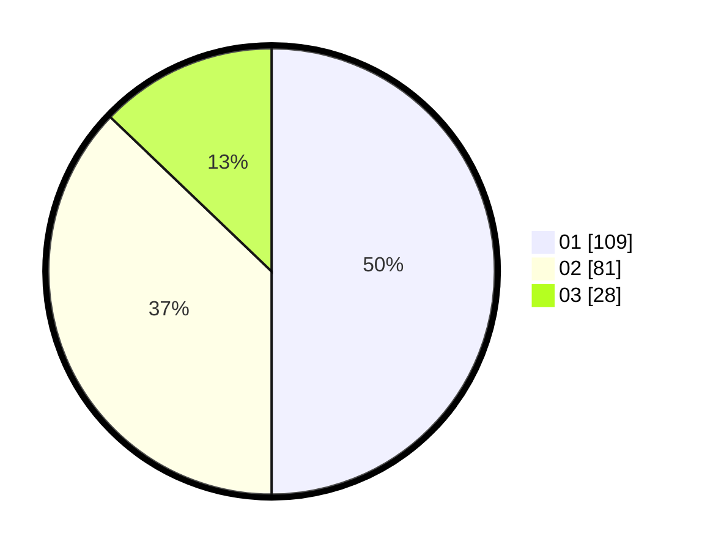

# Hasil

Hasil perolehan suara paslon dapat dilihat pada file paslon-01.txt, paslon-02.txt, dan paslon-03.txt.

Jika tidak ada, artinya data tersebut belum ada pada SIREKAP.

## Perolehan Suara

 * Paslon 01: **109**.
 * Paslon 02: **81**.
 * Paslon 03: **28**.

## Foto C Plano

https://sirekap-obj-formc.kpu.go.id/042d/pemilu/ppwp/31/75/09/10/02/3175091002020-20240214-195415--9ac5b539-907a-4ede-971e-2076fb39a6db.jpg

https://sirekap-obj-formc.kpu.go.id/042d/pemilu/ppwp/31/75/09/10/02/3175091002020-20240214-192144--384c2375-271c-4ee7-9334-6886986dffbf.jpg

https://sirekap-obj-formc.kpu.go.id/042d/pemilu/ppwp/31/75/09/10/02/3175091002020-20240214-192313--66ffefc2-be21-47b3-ac8f-28af70a7aa1c.jpg

## DATA PEMILIH TETAP

Jumlah pemilih dalam DPT: **279**.
 * L: **137**.
 * P: **142**.

## DATA PENGGUNA HAK PILIH

Jumlah pengguna hak pilih dalam DPT: **218**.
 * L: **101**.
 * P: **117**.

Jumlah pengguna hak pilih dalam DPTb: **0**.
 * L: **0**.
 * P: **0**.

Jumlah pengguna hak pilih dalam DPK: **0**.
 * L: **0**.
 * P: **0**.

Jumlah pengguna hak pilih: **218**.
 * L: **101**.
 * P: **117**.

## JUMLAH SUARA SAH DAN TIDAK SAH

JUMLAH SELURUH SUARA SAH: **218**.

JUMLAH SUARA TIDAK SAH: **0**.

JUMLAH SELURUH SUARA SAH DAN SUARA TIDAK SAH: **218**.
