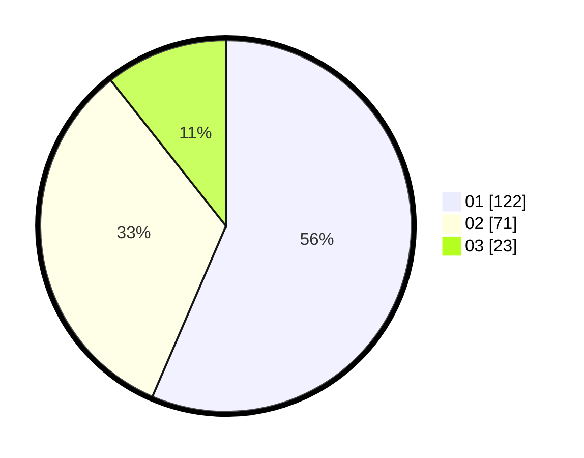

# Hasil

Hasil perolehan suara paslon dapat dilihat pada file paslon-01.txt, paslon-02.txt, dan paslon-03.txt.

Jika tidak ada, artinya data tersebut belum ada pada SIREKAP.

## Perolehan Suara

 * Paslon 01: **122**.
 * Paslon 02: **71**.
 * Paslon 03: **23**.

## Foto C Plano

https://sirekap-obj-formc.kpu.go.id/4c2d/pemilu/ppwp/31/75/09/10/02/3175091002021-20240214-200648--b4fa7ec6-8173-419c-8cf5-5c1be1f37c54.jpg

https://sirekap-obj-formc.kpu.go.id/4c2d/pemilu/ppwp/31/75/09/10/02/3175091002021-20240214-140954--be7e70dc-3064-484f-b023-a66fa27e2795.jpg

https://sirekap-obj-formc.kpu.go.id/4c2d/pemilu/ppwp/31/75/09/10/02/3175091002021-20240214-141648--9b52af7d-f70f-42fc-8462-550fb7ffd307.jpg
