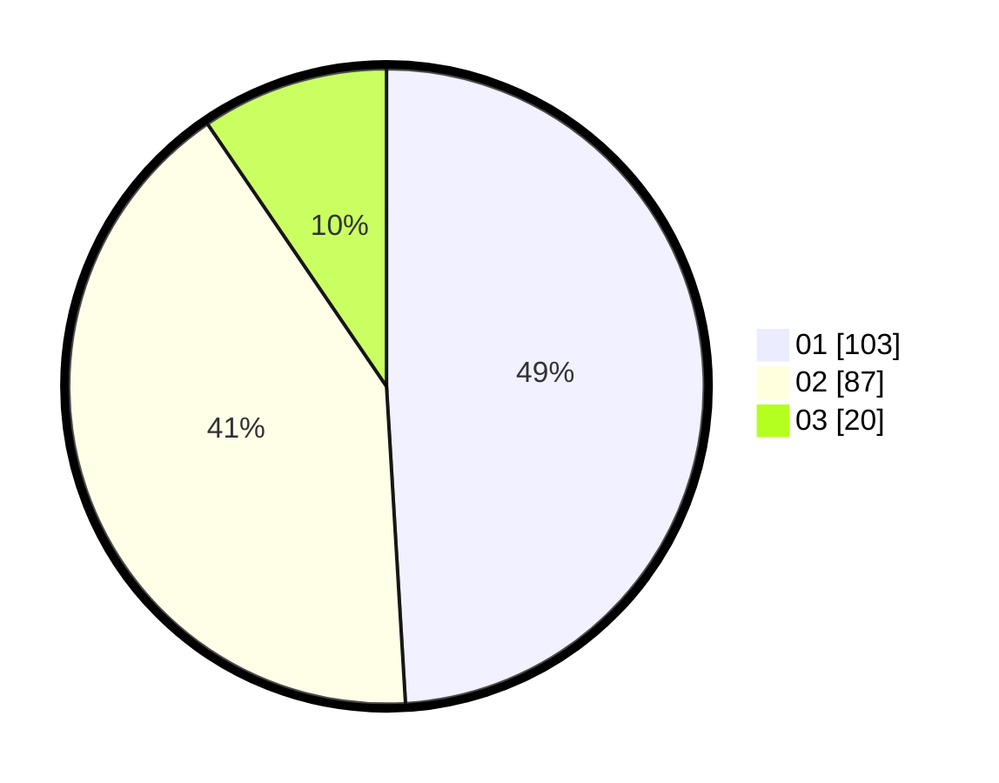

# Hasil

Hasil perolehan suara paslon dapat dilihat pada file paslon-01.txt, paslon-02.txt, dan paslon-03.txt.

Jika tidak ada, artinya data tersebut belum ada pada SIREKAP.

## Perolehan Suara

 * Paslon 01: **103**.
 * Paslon 02: **87**.
 * Paslon 03: **20**.

## Foto C Plano

https://sirekap-obj-formc.kpu.go.id/b41a/pemilu/ppwp/31/75/09/10/02/3175091002023-20240214-191934--ebd35f93-0389-4bea-8e6d-54567fe414ab.jpg

https://sirekap-obj-formc.kpu.go.id/b41a/pemilu/ppwp/31/75/09/10/02/3175091002023-20240214-192131--4e06c4ff-1275-49b7-9a77-3b879b3b8607.jpg

https://sirekap-obj-formc.kpu.go.id/b41a/pemilu/ppwp/31/75/09/10/02/3175091002023-20240214-192216--be64ba1e-4b85-4256-9d4b-28a0e61997cc.jpg
