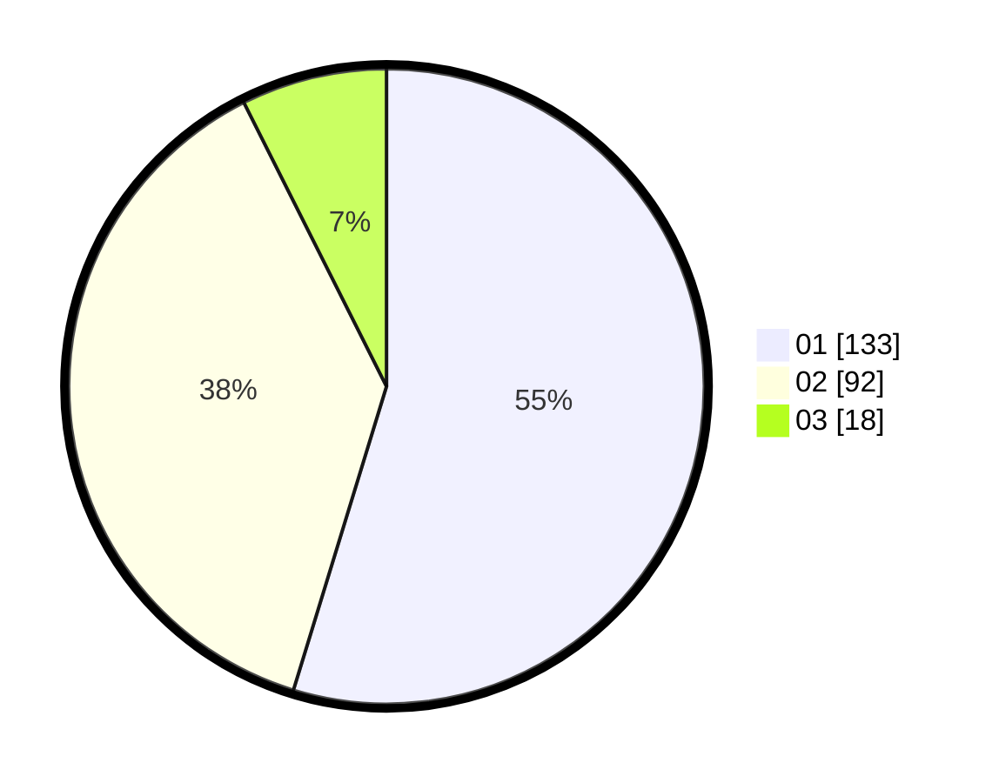

# Hasil

Hasil perolehan suara paslon dapat dilihat pada file paslon-01.txt, paslon-02.txt, dan paslon-03.txt.

Jika tidak ada, artinya data tersebut belum ada pada SIREKAP.

## Perolehan Suara

 * Paslon 01: **133**.
 * Paslon 02: **92**.
 * Paslon 03: **18**.

## Foto C Plano

https://sirekap-obj-formc.kpu.go.id/301c/pemilu/ppwp/31/75/09/10/02/3175091002026-20240214-234933--64ef27d5-ff89-4ce2-a4b8-be4e8a041a15.jpg

https://sirekap-obj-formc.kpu.go.id/301c/pemilu/ppwp/31/75/09/10/02/3175091002026-20240214-235021--8df6d557-bed1-4986-aeef-948bc5da187b.jpg

https://sirekap-obj-formc.kpu.go.id/301c/pemilu/ppwp/31/75/09/10/02/3175091002026-20240214-235142--03e0beac-7f2f-4473-8731-11edbb2964bf.jpg
