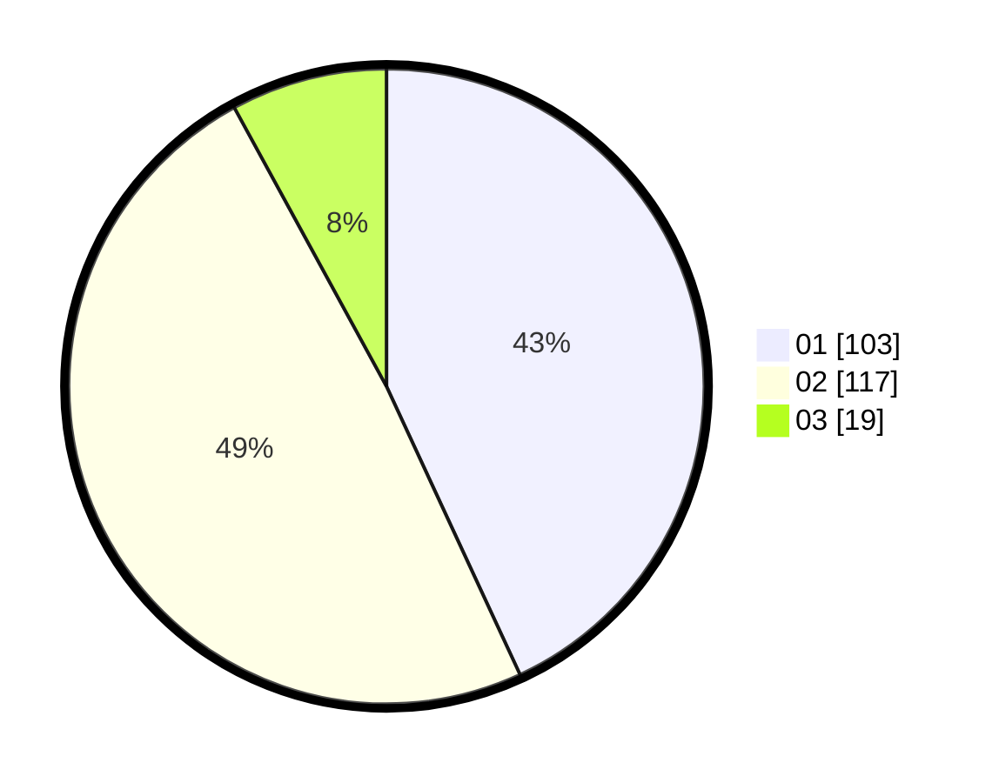

# Hasil

Hasil perolehan suara paslon dapat dilihat pada file paslon-01.txt, paslon-02.txt, dan paslon-03.txt.

Jika tidak ada, artinya data tersebut belum ada pada SIREKAP.

## Perolehan Suara

 * Paslon 01: **103**.
 * Paslon 02: **117**.
 * Paslon 03: **19**.

## Foto C Plano

https://sirekap-obj-formc.kpu.go.id/dcdd/pemilu/ppwp/31/75/09/10/02/3175091002029-20240215-160726--60e0f8ad-dc65-4d2f-a42e-ad685a4ed1f0.jpg

https://sirekap-obj-formc.kpu.go.id/dcdd/pemilu/ppwp/31/75/09/10/02/3175091002029-20240214-223749--059e8a3c-8df0-4e2c-9ee6-f9ec26ad7135.jpg

https://sirekap-obj-formc.kpu.go.id/dcdd/pemilu/ppwp/31/75/09/10/02/3175091002029-20240215-160848--60c2696e-f5dd-4d93-ad71-141109d4e828.jpg
